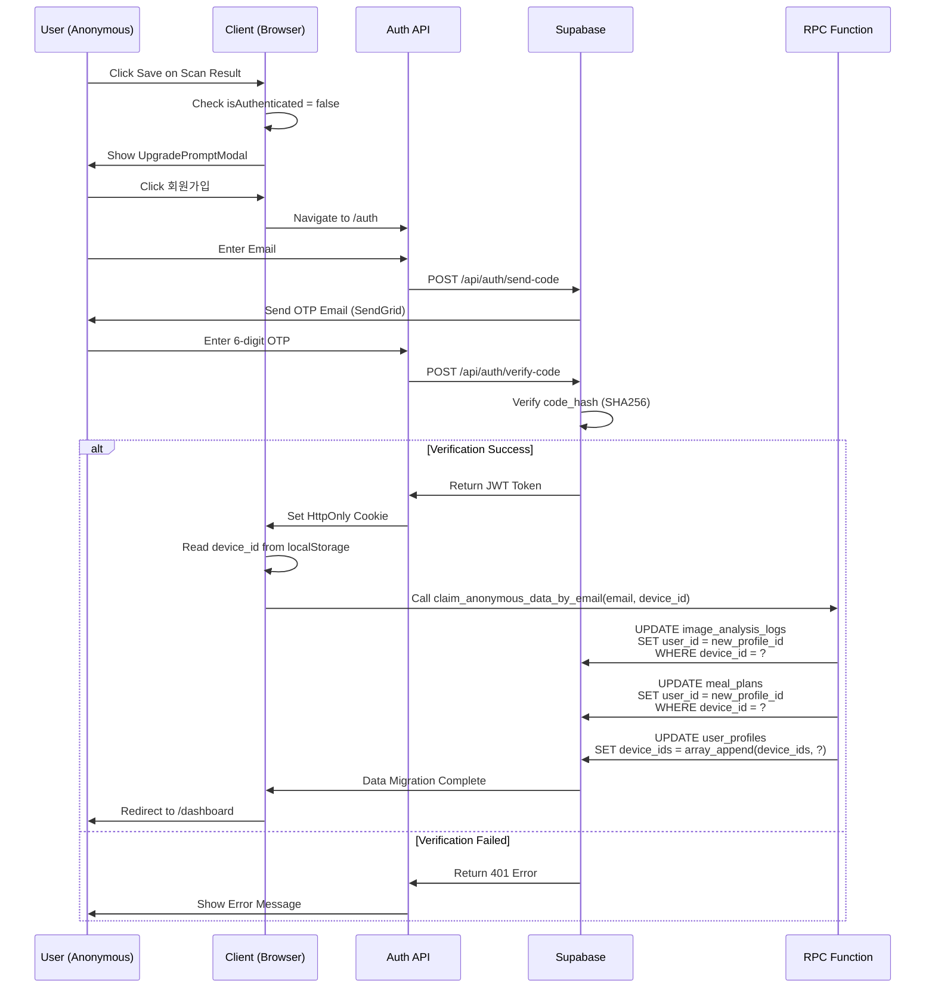

# 🗺️ MealRo Information Architecture (IA)

**Version:** 2.0  
**Last Updated:** 2026-01-23  
**Status:** Production

---

## 📋 Table of Contents

1. [Sitemap Overview](#sitemap-overview)
2. [Navigation Structure](#navigation-structure)
3. [Screen Hierarchy](#screen-hierarchy)
4. [User Journey Maps](#user-journey-maps)
5. [Content Strategy](#content-strategy)

---

## 1. Sitemap Overview

### 1.1 Site Structure

```
MealRo App
│
├── 🏠 Home (/)
│   ├── Hero Section
│   ├── Quick Actions (Meal Recommend, Scan)
│   ├── Onboarding Section
│   └── Restore Pending Meal
│
├── 🍽️ Meal Recommend (/meal)
│   ├── Meal Type Selection (아침/점심/저녁)
│   ├── AI Recommendations
│   ├── Filter Chips (건강/다이어트/근육)
│   └── Meal History (/meal/history) [Protected]
│
├── 📸 Scan (/scan)
│   ├── Camera Interface
│   ├── Food Analysis Result
│   ├── Bounding Box Tagging
│   ├── Portion Slider (0.5x ~ 1.5x)
│   └── Edit Bottom Sheet
│
├── 🌏 Feed (/feed)
│   ├── Public Feed (Others ate)
│   ├── Recent Entries (KST-based)
│   └── Anonymous Aggregation
│
├── 📊 Insights (/insights) [Protected]
│   ├── Weekly/Monthly Charts
│   ├── Calorie & Macro Breakdown
│   ├── Streak Tracking
│   └── KDRI Comparison
│
├── 🗺️ Nearby (/nearby)
│   ├── Map View
│   ├── Restaurant List
│   ├── Location-based Search
│   └── Item Detail (/item/[id])
│
├── 📜 History (/history) [Protected]
│   ├── Meal Log Timeline
│   ├── Date Filter
│   ├── Nutrition Summary
│   └── Edit/Delete Actions
│
├── 👤 MyPage (/mypage) [Protected]
│   ├── Profile (/mypage/profile)
│   │   ├── Email Display
│   │   ├── Auth Method
│   │   └── Last Login
│   │
│   ├── Goals (/mypage/goals)
│   │   ├── KDRI Settings
│   │   ├── Body Info (Weight, Height, Age)
│   │   ├── Activity Level
│   │   └── Goal Type (Diet/Muscle/Health)
│   │
│   ├── Connections (/mypage/connections)
│   │   ├── Linked Devices
│   │   └── Device IDs Management
│   │
│   ├── Data (/mypage/data)
│   │   ├── Export Data
│   │   ├── Delete Account
│   │   └── Privacy Settings
│   │
│   ├── Notifications (/mypage/notifications)
│   │   ├── Push Settings
│   │   ├── Email Alerts
│   │   └── Reminder Config
│   │
│   └── Settings (/mypage/settings)
│       ├── Theme (Light/Dark)
│       ├── Language
│       └── App Preferences
│
├── 🎯 Onboarding (/onboarding) [New Users]
│   ├── Step 1: Soft Goal Selection
│   ├── Step 2: Guest Trial (Camera)
│   ├── Step 3: Aha Moment (Simulated Result)
│   └── Step 4: Basic Info Collection
│
├── 🔐 Auth (/auth)
│   ├── Email Input
│   ├── OTP Verification (6-digit)
│   ├── Purpose (signup/login)
│   └── Return URL Handling
│
├── ℹ️ About (/about)
│   ├── App Introduction
│   ├── Tech Stack
│   └── Contact Info
│
└── ⚠️ Disclaimer (/disclaimer)
    ├── Legal Notice
    ├── Nutrition Accuracy
    └── Medical Disclaimer
```

---

## 2. Navigation Structure

### 2.1 Bottom Navigation (Primary)

**5-Tab Fixed Navigation** (Visible on all pages except `/onboarding`, `/auth`)

| Tab | Icon | Route | Auth Required | Description |
|-----|------|-------|---------------|-------------|
| **홈** | 🏠 | `/` | ❌ No | Main landing page with quick actions |
| **끼니추천** | 🍽️ | `/meal` | ❌ No | AI-powered meal recommendations |
| **주변맛집** | 🗺️ | `/nearby` | ❌ No | Location-based restaurant discovery |
| **대시보드** | 📊 | `/dashboard` | ✅ Yes | Nutrition analytics (redirects to `/insights`) |
| **기록** | 🕐 | `/history` | ✅ Yes | Meal log history |

**Locked State Behavior:**
- Anonymous users see 🔒 icon on protected tabs
- Clicking locked tabs triggers `UpgradePromptModal`
- Modal prompts user to sign up/login

### 2.2 Top Navigation (Header)

**Dynamic Header** (Context-aware)

| User State | Left Side | Center | Right Side |
|------------|-----------|--------|------------|
| **Anonymous** | App Logo | Page Title | "로그인" Button |
| **Authenticated** | App Logo | Page Title | User Email + "로그아웃" |

### 2.3 Floating Action Button (FAB)

**Scan FAB** (Visible on `/` and `/meal`)
- Position: Bottom-right, 80px from bottom
- Action: Navigate to `/scan`
- Icon: 📸 Camera
- Color: Primary Green (#10B981)

---

## 3. Screen Hierarchy

### 3.1 Information Hierarchy by Page

#### 🏠 Home Page (`/`)

**Desktop Layout (2-Column Grid)**
```
┌─────────────────────────────────────────────────┐
│ Header (Logo + Auth Status)                     │
├──────────────────┬──────────────────────────────┤
│ Left Column      │ Right Column                 │
│ (Sticky)         │                              │
│                  │ Hero Section                 │
│ - Restore Modal  │ - Title                      │
│ - Onboarding     │ - Description                │
│ - Health Tip     │ - CTA Buttons                │
│                  │                              │
│                  │ Feature Cards                │
│                  │ - 아침/점심/저녁             │
│                  │                              │
│                  │ Info Section                 │
│                  │ - Disclaimer Link            │
└──────────────────┴──────────────────────────────┘
│ Bottom Navigation (5 Tabs)                      │
└─────────────────────────────────────────────────┘
```

**Mobile Layout (Single Column)**
```
┌─────────────────────────────────┐
│ Header                          │
├─────────────────────────────────┤
│ Hero Section                    │
│ - Title                         │
│ - Description                   │
│                                 │
│ CTA Buttons (Grid 2x1)          │
│ ┌──────────┬──────────┐         │
│ │ 끼니추천 │ 음식스캔 │         │
│ └──────────┴──────────┘         │
│                                 │
│ Restore Pending Meal            │
│ Onboarding Section              │
│                                 │
│ Feature Cards (3x1)             │
│ Info Section                    │
└─────────────────────────────────┘
│ Bottom Navigation               │
└─────────────────────────────────┘
```

#### 📸 Scan Page (`/scan`)

**Z-Index Layering**
```
Layer 5: Edit Bottom Sheet (z-50)
Layer 4: Analysis Progress Modal (z-40)
Layer 3: Bounding Box Overlay (z-30)
Layer 2: Camera Preview (z-20)
Layer 1: Background (z-10)
```

**Component Hierarchy**
```
FoodScanner
├── Camera Interface
│   ├── Video Stream
│   ├── Capture Button
│   └── Gallery Upload
│
├── Bounding Box Overlay
│   ├── SVG Canvas
│   ├── Interactive Handles
│   └── Food Labels
│
├── Analysis Progress
│   ├── Loading Animation
│   ├── Progress Bar
│   └── Status Text
│
├── Food Analysis Result
│   ├── Nutrition Summary
│   ├── KDRI Comparison
│   ├── Portion Slider
│   └── Save Button
│
└── Edit Bottom Sheet
    ├── Food Name Input
    ├── Calorie Adjustment
    └── Confirm/Cancel
```

#### 📊 Insights Page (`/insights`) [Protected]

**Tab Structure**
```
Insights Dashboard
├── Tab 1: Weekly View
│   ├── Calorie Chart (Line)
│   ├── Macro Breakdown (Pie)
│   └── Daily Average
│
├── Tab 2: Monthly View
│   ├── Calorie Heatmap
│   ├── Trend Analysis
│   └── Goal Progress
│
└── Tab 3: Streak
    ├── Current Streak
    ├── Longest Streak
    └── Achievement Badges
```

#### 👤 MyPage (`/mypage`) [Protected]

**Card-based Navigation**
```
MyPage Hub
├── Profile Card
│   └── → /mypage/profile
│
├── Goals Card
│   └── → /mypage/goals
│
├── Connections Card
│   └── → /mypage/connections
│
├── Data Card
│   └── → /mypage/data
│
├── Notifications Card
│   └── → /mypage/notifications
│
└── Settings Card
    └── → /mypage/settings
```

---

## 4. User Journey Maps

### 4.1 First-Time User Journey (Guest → Verified)

```mermaid
graph TD
    A[App Launch] --> B{Has Account?}
    B -->|No| C[View Home Page]
    B -->|Yes| D[Login via /auth]
    
    C --> E[Click 음식 스캔하기]
    E --> F[/scan - Camera Interface]
    F --> G[Capture Food Photo]
    G --> H[AI Analysis Running]
    H --> I[View Analysis Result]
    
    I --> J{Want to Save?}
    J -->|Yes| K[Click Save Button]
    K --> L[UpgradePromptModal Appears]
    L --> M[Click 회원가입]
    M --> N[/auth - Email Input]
    N --> O[Receive OTP Email]
    O --> P[Enter 6-digit Code]
    P --> Q[Verification Success]
    
    Q --> R[claim_anonymous_data RPC]
    R --> S[Data Migrated to Profile]
    S --> T[Redirect to /dashboard]
    
    J -->|No| U[Continue as Guest]
    U --> V[Explore /meal or /nearby]
    
    D --> W[OTP Verification]
    W --> X[Login Success]
    X --> T
```

### 4.2 Meal Recommendation Flow

```mermaid
graph LR
    A[Home Page] --> B[Click 끼니 추천 받기]
    B --> C[/meal - Meal Type Selection]
    C --> D{Select Meal Type}
    
    D -->|아침| E1[Breakfast Recommendations]
    D -->|점심| E2[Lunch Recommendations]
    D -->|저녁| E3[Dinner Recommendations]
    
    E1 --> F[Filter by Goal]
    E2 --> F
    E3 --> F
    
    F --> G{Apply Filter?}
    G -->|건강| H1[Health-focused Results]
    G -->|다이어트| H2[Diet-focused Results]
    G -->|근육| H3[Muscle-focused Results]
    
    H1 --> I[View Meal Card]
    H2 --> I
    H3 --> I
    
    I --> J{Interested?}
    J -->|Yes| K[Click Card]
    K --> L[/item/[id] - Detail View]
    L --> M[View Nutrition Info]
    
    J -->|No| N[Scroll for More]
    N --> I
```

### 4.3 Scan & Save Flow

```mermaid
graph TD
    A[/scan Page] --> B[Camera Active]
    B --> C{Input Method?}
    
    C -->|Camera| D[Tap Capture Button]
    C -->|Gallery| E[Upload from Gallery]
    
    D --> F[Image Captured]
    E --> F
    
    F --> G[Send to GPT-4o Vision API]
    G --> H[AI Processing 3-5s]
    H --> I[Receive Analysis Result]
    
    I --> J{Confidence ≥ 80%?}
    J -->|Yes| K[Show Single Result]
    J -->|No| L[Show Top-3 Candidates]
    
    L --> M[User Selects Correct Food]
    M --> K
    
    K --> N[Display Nutrition Card]
    N --> O[Adjust Portion Slider]
    O --> P{Need to Edit?}
    
    P -->|Yes| Q[Open Edit Bottom Sheet]
    Q --> R[Modify Food Name/Calories]
    R --> S[Confirm Changes]
    S --> T[Updated Result]
    
    P -->|No| T
    T --> U{Click Save?}
    
    U -->|Yes| V{isAuthenticated?}
    V -->|Yes| W[Save to Supabase]
    V -->|No| X[Show UpgradePromptModal]
    
    W --> Y[Success Snackbar]
    Y --> Z[Redirect to /history]
    
    X --> AA[User Chooses Action]
    AA -->|Sign Up| AB[/auth Flow]
    AA -->|Cancel| AC[Stay on /scan]
    
    U -->|No| AD[Discard Result]
    AD --> B
```

### 4.4 Data Claim Flow (Anonymous → Verified)



---

## 5. Content Strategy

### 5.1 Content Prioritization Matrix

| Priority | Content Type | Pages | Purpose |
|----------|-------------|-------|---------|
| **P0 (Critical)** | AI Analysis Result | `/scan` | Core value proposition |
| **P0** | Meal Recommendations | `/meal` | Primary engagement driver |
| **P0** | Nutrition Dashboard | `/insights` | Retention & habit formation |
| **P1 (High)** | Onboarding Flow | `/onboarding` | User activation |
| **P1** | Public Feed | `/feed` | Social proof & discovery |
| **P1** | Nearby Restaurants | `/nearby` | Offline-to-online bridge |
| **P2 (Medium)** | History Log | `/history` | Data review & editing |
| **P2** | MyPage Settings | `/mypage/*` | Personalization |
| **P3 (Low)** | About/Disclaimer | `/about`, `/disclaimer` | Legal compliance |

### 5.2 Microcopy Guidelines

#### Call-to-Action (CTA) Buttons

| Context | Primary CTA | Secondary CTA |
|---------|-------------|---------------|
| Home Hero | "끼니 추천 받기" | "음식 스캔하기" |
| Scan Result | "저장하기" | "다시 촬영" |
| Upgrade Modal | "회원가입" | "나중에" |
| Auth Page | "인증번호 발송" | "취소" |
| Analysis Complete | "대시보드 보기" | "계속 스캔" |

#### Empty States

| Page | Empty State Message | CTA |
|------|---------------------|-----|
| `/history` | "아직 기록된 식단이 없어요<br/>첫 끼니를 스캔해보세요!" | "음식 스캔하기" |
| `/insights` | "데이터가 쌓이면 통계를 볼 수 있어요<br/>최소 3일의 기록이 필요합니다" | "기록 시작하기" |
| `/feed` | "아직 공유된 식단이 없어요<br/>첫 번째 기여자가 되어보세요!" | "내 식단 공유하기" |

#### Error Messages

| Error Type | Message | Action |
|------------|---------|--------|
| Network Error | "인터넷 연결을 확인해주세요" | "다시 시도" |
| AI Analysis Failed | "음식을 인식하지 못했어요<br/>다른 각도로 다시 촬영해주세요" | "재촬영" |
| OTP Expired | "인증번호가 만료되었습니다<br/>새로운 코드를 요청해주세요" | "재발송" |
| Auth Required | "로그인이 필요한 기능입니다" | "로그인하기" |

### 5.3 Accessibility (a11y) Considerations

#### ARIA Labels

```typescript
// Bottom Navigation
<nav aria-label="주요 네비게이션">
  <Link aria-label="홈으로 이동" aria-current={isActive ? "page" : undefined}>
    홈
  </Link>
</nav>

// Scan Button
<button aria-label="음식 사진 촬영" aria-describedby="scan-help-text">
  📸
</button>

// Locked Tabs
<Link aria-label="대시보드 (로그인 필요)" aria-disabled="true">
  🔒 대시보드
</Link>
```

#### Keyboard Navigation

| Key | Action |
|-----|--------|
| `Tab` | Navigate through interactive elements |
| `Enter` / `Space` | Activate buttons/links |
| `Esc` | Close modals/bottom sheets |
| `Arrow Keys` | Navigate between tabs |

#### Focus Management

- **Modal Open**: Focus trap within modal
- **Modal Close**: Return focus to trigger element
- **Page Load**: Focus on main heading (`<h1>`)
- **Form Errors**: Focus on first error field

---

## 6. Route Protection Matrix

| Route | Auth Required | Redirect If Unauthenticated | Redirect If Authenticated |
|-------|---------------|----------------------------|---------------------------|
| `/` | ❌ No | - | - |
| `/meal` | ❌ No | - | - |
| `/scan` | ❌ No | - | - |
| `/feed` | ❌ No | - | - |
| `/nearby` | ❌ No | - | - |
| `/item/[id]` | ❌ No | - | - |
| `/about` | ❌ No | - | - |
| `/disclaimer` | ❌ No | - | - |
| `/auth` | ❌ No | - | `/dashboard` (if already logged in) |
| `/onboarding` | ❌ No | - | `/dashboard` (skip if completed) |
| `/insights` | ✅ Yes | `/auth?returnUrl=/insights` | - |
| `/dashboard` | ✅ Yes | `/auth?returnUrl=/dashboard` | - |
| `/history` | ✅ Yes | `/auth?returnUrl=/history` | - |
| `/mypage` | ✅ Yes | `/auth?returnUrl=/mypage` | - |
| `/mypage/profile` | ✅ Yes | `/auth` | - |
| `/mypage/goals` | ✅ Yes | `/auth` | - |
| `/mypage/connections` | ✅ Yes | `/auth` | - |
| `/mypage/data` | ✅ Yes | `/auth` | - |
| `/mypage/notifications` | ✅ Yes | `/auth` | - |
| `/mypage/settings` | ✅ Yes | `/auth` | - |
| `/meal/history` | ✅ Yes | `/auth?returnUrl=/meal/history` | - |

---

## 7. Mobile-First Responsive Breakpoints

| Breakpoint | Width | Target Device | Layout Changes |
|------------|-------|---------------|----------------|
| **xs** | < 640px | Mobile (Portrait) | Single column, stacked cards |
| **sm** | ≥ 640px | Mobile (Landscape) | 2-column grid for cards |
| **md** | ≥ 768px | Tablet | Sidebar appears, larger touch targets |
| **lg** | ≥ 1024px | Desktop | 2-column layout (sidebar + main), hover states |
| **xl** | ≥ 1280px | Large Desktop | Max-width container (1280px), wider charts |

---

## 8. Performance Optimization Strategy

### 8.1 Code Splitting

```typescript
// Route-based code splitting (Next.js automatic)
/app/scan/page.tsx → scan.chunk.js
/app/insights/page.tsx → insights.chunk.js
/app/mypage/page.tsx → mypage.chunk.js

// Component-based lazy loading
const AnalysisProgress = dynamic(() => import('@/components/scan/AnalysisProgress'));
const EditBottomSheet = dynamic(() => import('@/components/scan/EditBottomSheet'));
```

### 8.2 Image Optimization

- **Format**: WebP with JPEG fallback
- **Lazy Loading**: `loading="lazy"` for below-fold images
- **Responsive Images**: `srcset` for different screen sizes
- **CDN**: Supabase Storage for uploaded images

### 8.3 Data Fetching Strategy

| Page | Strategy | Cache Duration |
|------|----------|----------------|
| `/` | Static Generation (SSG) | Revalidate every 1 hour |
| `/meal` | Server-Side Rendering (SSR) | No cache (personalized) |
| `/scan` | Client-Side Rendering (CSR) | No cache (real-time) |
| `/insights` | Incremental Static Regeneration (ISR) | Revalidate every 5 minutes |
| `/feed` | SSR with SWR | Stale-while-revalidate |

---

## 9. Analytics & Tracking Plan

### 9.1 Key Events to Track

| Event Name | Trigger | Properties |
|------------|---------|------------|
| `page_view` | Every page load | `page_path`, `user_type` (anonymous/verified) |
| `scan_initiated` | Camera opened | `source` (home/fab/meal) |
| `scan_completed` | AI analysis done | `confidence_score`, `food_detected`, `processing_time` |
| `scan_saved` | Save button clicked | `is_authenticated`, `portion_adjusted` |
| `upgrade_modal_shown` | Modal displayed | `trigger_action` (save/dashboard/history) |
| `signup_started` | Email entered | `referrer_page` |
| `signup_completed` | OTP verified | `has_anonymous_data`, `claimed_records_count` |
| `meal_recommended` | Recommendation viewed | `meal_type`, `filter_applied` |
| `nearby_searched` | Map interaction | `location_lat`, `location_lng` |

### 9.2 Conversion Funnel

```
Anonymous User Activation Funnel:
1. Landing (/) → 100%
2. Scan Initiated → 60%
3. Analysis Completed → 50%
4. Save Attempted → 30%
5. Upgrade Modal Shown → 30%
6. Signup Started → 15%
7. Signup Completed → 10%

Target Conversion Rate: 10% (Anonymous → Verified)
```

---

## 10. SEO & Meta Tags Strategy

### 10.1 Page-Specific Meta Tags

```typescript
// app/page.tsx (Home)
export const metadata = {
  title: 'MealRo - AI 영양 코치 | 음식 스캔으로 건강 관리',
  description: '사진 한 장으로 영양 분석! AI가 추천하는 맞춤 식단으로 건강한 하루를 시작하세요.',
  keywords: '식단 관리, 영양 분석, AI 음식 인식, KDRI, 칼로리 계산',
  openGraph: {
    title: 'MealRo - 가장 빠른 식단 기록',
    description: '가입 없이 즉시 사용 가능한 AI 영양 코치',
    images: ['/og-image.png'],
  },
};

// app/scan/page.tsx
export const metadata = {
  title: '음식 스캔 - MealRo',
  description: 'AI가 음식을 인식하고 영양 정보를 분석합니다',
  robots: 'noindex', // Prevent indexing of functional pages
};
```

### 10.2 Structured Data (JSON-LD)

```json
{
  "@context": "https://schema.org",
  "@type": "MobileApplication",
  "name": "MealRo",
  "applicationCategory": "HealthApplication",
  "operatingSystem": "Web, iOS, Android",
  "offers": {
    "@type": "Offer",
    "price": "0",
    "priceCurrency": "KRW"
  },
  "aggregateRating": {
    "@type": "AggregateRating",
    "ratingValue": "4.8",
    "ratingCount": "1250"
  }
}
```

---

## 11. Internationalization (i18n) Readiness

### 11.1 Language Support (Future)

| Language | Code | Priority | Target Market |
|----------|------|----------|---------------|
| 한국어 (Korean) | `ko-KR` | P0 | Primary (Current) |
| English | `en-US` | P1 | Global expansion |
| 日本語 (Japanese) | `ja-JP` | P2 | Asian market |

### 11.2 Localization Considerations

- **Date/Time**: Use `Intl.DateTimeFormat` for KST display
- **Numbers**: Use `Intl.NumberFormat` for calorie formatting
- **Currency**: KRW (₩) for premium features (future)
- **Units**: Metric system (g, kcal, cm, kg)

---

**Document End**

> 💡 **Note**: This IA document should be updated whenever new routes, navigation patterns, or user flows are added to the MealRo app.
