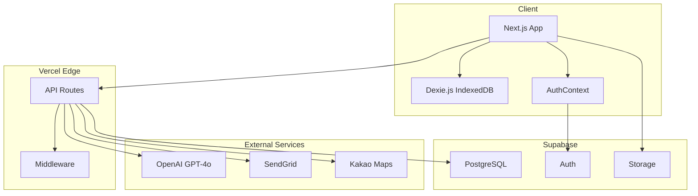

# 📋 MealRo Product Requirements Document (PRD)

**Version:** 3.0  
**Last Updated:** 2026-01-23  
**Status:** Production  
**Product Manager:** MealRo Team  
**Target Launch:** Q1 2026

---

## 📑 Table of Contents

1. [Executive Summary](#1-executive-summary)
2. [Problem Statement](#2-problem-statement)
3. [Target Users](#3-target-users)
4. [Product Vision & Goals](#4-product-vision--goals)
5. [Core Features](#5-core-features)
6. [User Stories](#6-user-stories)
7. [Information Architecture](#7-information-architecture)
8. [User Flows](#8-user-flows)
9. [Technical Architecture](#9-technical-architecture)
10. [Data Model](#10-data-model)
11. [API Specifications](#11-api-specifications)
12. [UI/UX Requirements](#12-uiux-requirements)
13. [Security & Privacy](#13-security--privacy)
14. [Performance Requirements](#14-performance-requirements)
15. [Analytics & Metrics](#15-analytics--metrics)
16. [Compliance & Legal](#16-compliance--legal)
17. [Future Roadmap](#17-future-roadmap)

---

## 1. Executive Summary

**MealRo** is an AI-powered nutrition coaching Progressive Web App (PWA) designed for the Korean market. It leverages computer vision (GPT-4o Vision) to analyze food instantly and compares nutritional data against the **2025 KDRI (Korea Dietary Reference Intakes)** standards.

### Key Differentiators

1. **Guest-First Experience**: Users can scan and analyze food without creating an account
2. **Progressive Onboarding**: Value-driven journey that defers sign-up until after the "Aha! Moment"
3. **Smart Data Restore**: Anonymous data is automatically migrated when users upgrade to verified accounts
4. **Privacy by Design**: Food images are never stored, only analyzed in-memory

### Success Metrics (MVP)

- **Activation Rate**: 60% of visitors complete at least one scan
- **Conversion Rate**: 10% of anonymous users upgrade to verified accounts
- **Retention (D7)**: 30% of verified users return within 7 days
- **Analysis Accuracy**: 80%+ confidence score on food detection

---

## 2. Problem Statement

### Current Pain Points

| Problem | Impact | User Quote |
|---------|--------|------------|
| **Forced Registration** | High drop-off before experiencing value | *"왜 가입부터 해야 해? 일단 써보고 싶은데..."* |
| **Complex Input** | Manual food logging is tedious | *"매번 검색하고 입력하는 게 너무 귀찮아요"* |
| **Generic Recommendations** | One-size-fits-all nutrition advice | *"내 몸에 맞는 정보가 아니라 의미가 없어요"* |
| **Data Loss Anxiety** | Fear of losing progress when switching devices | *"폰 바꾸면 데이터 다 날아가나요?"* |

### Market Gap

Existing Korean diet apps (e.g., 다노, 눔코치) require:
- Upfront payment or subscription
- Mandatory account creation
- Manual food entry
- No AI-powered visual recognition

**MealRo fills this gap** by offering:
- Free tier with core features
- Anonymous usage without barriers
- AI-powered instant analysis
- Seamless data migration

---

## 3. Target Users

### Primary Persona: "건강한 지은" (Health-Conscious Jieun)

**Demographics**
- Age: 25-35
- Gender: Female (60%), Male (40%)
- Location: Seoul, Busan, Incheon (Urban areas)
- Occupation: Office worker, Student
- Tech Savviness: High (smartphone native)

**Psychographics**
- **Goals**: Maintain healthy weight, improve eating habits, track macros
- **Motivations**: Self-improvement, body confidence, preventive health
- **Frustrations**: Lack of time, confusing nutrition info, app fatigue
- **Behaviors**: Uses Instagram for food inspiration, tries new diets frequently

**User Journey**
1. Discovers MealRo via social media ad or friend referral
2. Scans first meal out of curiosity (no account needed)
3. Impressed by instant AI analysis
4. Scans 2-3 more meals over the next few days
5. Wants to save history → creates account
6. Becomes daily active user, checks dashboard weekly

### Secondary Persona: "다이어트 중인 민수" (Dieting Minsu)

**Demographics**
- Age: 28-40
- Gender: Male (70%), Female (30%)
- Goal: Weight loss (target: -10kg in 3 months)

**Needs**
- Calorie deficit tracking
- Macro breakdown (protein focus)
- Progress visualization
- Accountability tools

---

## 4. Product Vision & Goals

### Vision Statement

> **"가장 빠른 식단 기록, 가장 정확한 영양 분석"**  
> *The fastest meal logging, the most accurate nutrition analysis*

### Product Goals (2026 Q1-Q2)

| Goal | Metric | Target |
|------|--------|--------|
| **User Acquisition** | Total Registered Users | 10,000 |
| **Engagement** | Daily Active Users (DAU) | 1,500 |
| **Retention** | D30 Retention Rate | 25% |
| **Conversion** | Anonymous → Verified | 10% |
| **Quality** | AI Confidence Score Avg | 85% |
| **Performance** | Analysis Response Time | < 5 seconds |

### Business Goals

- **Monetization** (Future): Premium tier with advanced analytics, meal planning, coach consultation
- **Partnerships**: Collaborate with Korean restaurants for verified nutrition data
- **Data Insights**: Aggregate anonymous data for public health research (opt-in)

---

## 5. Core Features

### 5.1 AI Food Lens 📸

**Description**: Computer vision-powered food recognition and nutrition analysis

**Functional Requirements**
- ✅ Support camera capture and gallery upload
- ✅ Detect multiple food items in a single image
- ✅ Provide bounding box visualization for each detected food
- ✅ Return nutrition breakdown (calories, protein, carbs, fat, fiber, sodium)
- ✅ Compare against KDRI 2025 standards
- ✅ Allow portion adjustment (0.5x, 1.0x, 1.5x slider)

**Technical Specs**
- **AI Model**: OpenAI GPT-4o Vision API
- **Input**: JPEG/PNG, max 5MB, 1024x1024px (auto-resize)
- **Output**: JSON with food items, confidence scores, nutrition data
- **Latency**: Target < 5s (p95)

**Edge Cases**
- **Low Confidence (< 80%)**: Show top-3 candidate foods for user selection
- **No Food Detected**: Prompt user to retake photo with better lighting/angle
- **Multiple Dishes**: Allow user to select which items to analyze

**User Flow**
```
1. User opens /scan
2. Camera preview appears
3. User captures photo OR uploads from gallery
4. Loading animation (3-5s)
5. Bounding boxes appear on detected foods
6. User taps each box to view nutrition
7. User adjusts portion slider if needed
8. User clicks "저장하기" (Save)
   → If authenticated: Save to Supabase
   → If anonymous: Show UpgradePromptModal
```

### 5.2 2-Tier Authentication System 🔐

**Description**: Passwordless email OTP authentication with anonymous-to-verified upgrade path

#### Tier 1: Anonymous (Guest Mode)

**Identifier**: `device_id` (UUID stored in localStorage)

**Capabilities**
- ✅ Scan food and view AI analysis (temporary, session-based)
- ✅ Browse meal recommendations
- ✅ Explore nearby restaurants
- ✅ View public feed

**Limitations**
- ❌ Cannot save scan results permanently
- ❌ No access to dashboard/insights
- ❌ No access to history log
- ❌ No cross-device sync

**Data Storage**
- Temporary scan results stored in IndexedDB (Dexie.js)
- Data persists until browser cache is cleared
- `device_id` links anonymous records

#### Tier 2: Verified (Authenticated)

**Identifier**: Email + JWT (HttpOnly cookie)

**Capabilities**
- ✅ All Anonymous features
- ✅ Permanent data storage in Supabase
- ✅ Access to dashboard and insights
- ✅ View and edit meal history
- ✅ Cross-device sync
- ✅ KDRI goal customization
- ✅ Export data (CSV/JSON)

**Authentication Method**
- **Email OTP (Passwordless)**
  - User enters email
  - System sends 6-digit code via SendGrid
  - Code expires in 3 minutes
  - Max 5 verification attempts
  - SHA256 hashed code stored in DB

**Security Measures**
- JWT stored in HttpOnly cookie (XSS protection)
- CSRF token validation
- Rate limiting on OTP requests (max 3 per 10 minutes per email)
- IP-based abuse detection

**Data Migration Flow**
```
1. Anonymous user clicks "Save" on scan result
2. UpgradePromptModal appears
3. User clicks "회원가입" (Sign Up)
4. Redirected to /auth with returnUrl parameter
5. User enters email → OTP sent
6. User enters 6-digit code → Verified
7. System calls claim_anonymous_data_by_email RPC
8. All device_id-linked records transferred to new user_id
9. User redirected to /dashboard with saved data
```

### 5.3 KDRI 2025 Calculator 📊

**Description**: Personalized nutrition goals based on Korean Dietary Reference Intakes

**Input Parameters**
- Age (years)
- Gender (Male/Female)
- Weight (kg)
- Height (cm)
- Activity Level (Sedentary, Light, Moderate, Active, Very Active)
- Goal (Maintain, Lose Weight, Gain Muscle)

**Output**
- **TDEE** (Total Daily Energy Expenditure)
- **Target Calories** (adjusted for goal)
- **Macro Targets**
  - Protein (g): 0.8-1.2g per kg body weight
  - Carbs (g): 45-65% of total calories
  - Fat (g): 20-35% of total calories
- **Micronutrient Recommendations** (Fiber, Sodium, Vitamins)

**Calculation Formula**
```typescript
// Basal Metabolic Rate (BMR) - Mifflin-St Jeor Equation
BMR_male = (10 × weight_kg) + (6.25 × height_cm) - (5 × age) + 5
BMR_female = (10 × weight_kg) + (6.25 × height_cm) - (5 × age) - 161

// Total Daily Energy Expenditure (TDEE)
TDEE = BMR × Activity_Multiplier
// Activity Multipliers:
// Sedentary: 1.2
// Light: 1.375
// Moderate: 1.55
// Active: 1.725
// Very Active: 1.9

// Goal Adjustment
if (goal === 'lose_weight') targetCalories = TDEE - 500; // -0.5kg/week
if (goal === 'gain_muscle') targetCalories = TDEE + 300; // +0.3kg/week
if (goal === 'maintain') targetCalories = TDEE;
```

### 5.4 Public Feed (Opt-in) 🌏

**Description**: Anonymous aggregation of user-shared meals for social discovery

**Features**
- ✅ Users can opt-in to share meals publicly
- ✅ All shared data is anonymized (no user identifiers)
- ✅ Display format: "Someone ate [Food Name] at [Time] in [City]"
- ✅ KST timezone for all timestamps
- ✅ Real-time updates (SWR cache strategy)

**Privacy Controls**
- Default: Opt-out (sharing disabled)
- User must explicitly enable "공개 피드 공유" in settings
- Can toggle on/off per meal
- Shared data excludes: email, name, profile photo

**Data Model**
```sql
CREATE TABLE public_food_events (
  id UUID PRIMARY KEY,
  food_name TEXT NOT NULL,
  meal_type TEXT, -- breakfast/lunch/dinner
  city TEXT, -- Seoul, Busan, etc.
  created_at TIMESTAMPTZ DEFAULT NOW(),
  day_key TEXT -- YYYY-MM-DD in KST
);
```

### 5.5 Nearby Restaurants 🗺️

**Description**: Location-based restaurant discovery with nutrition info

**Features**
- ✅ Map view with restaurant markers
- ✅ Filter by cuisine type (Korean, Japanese, Western, etc.)
- ✅ Show distance from user's location
- ✅ Display average nutrition data for popular menu items
- ✅ Link to detailed menu analysis

**Data Source**
- Kakao Maps API for restaurant data
- User-contributed nutrition data (verified by community)
- Partner restaurant API integrations (future)

### 5.6 Insights Dashboard 📈

**Description**: Visual analytics for nutrition trends and goal progress

**Widgets**
1. **Calorie Trend Chart** (Line chart, 7-day or 30-day view)
2. **Macro Breakdown** (Pie chart: Protein/Carbs/Fat %)
3. **KDRI Comparison** (Progress bars: Daily intake vs. target)
4. **Streak Tracker** (Consecutive days logged)
5. **Meal Distribution** (Breakfast/Lunch/Dinner calorie split)

**Interactivity**
- Tap on chart points to view meal details
- Filter by date range
- Export data as CSV

---

## 6. User Stories

### Epic 1: First-Time User Activation

**US-001**: As a **new visitor**, I want to **scan a food item without creating an account**, so that **I can experience the value before committing**.

**Acceptance Criteria**
- [ ] User can access /scan without authentication
- [ ] Camera permission is requested on first use
- [ ] AI analysis completes within 5 seconds
- [ ] Result shows nutrition breakdown and KDRI comparison
- [ ] User sees "Save" button with lock icon if not authenticated

---

**US-002**: As an **anonymous user**, I want to **see a prompt to sign up when I try to save**, so that **I understand the benefits of creating an account**.

**Acceptance Criteria**
- [ ] UpgradePromptModal appears when clicking "Save" as guest
- [ ] Modal explains: "데이터를 잃지 마세요! 가입하면 모든 기록이 저장됩니다"
- [ ] Modal has two CTAs: "회원가입" (primary) and "나중에" (secondary)
- [ ] Clicking "회원가입" redirects to /auth with returnUrl

---

### Epic 2: Authentication & Data Migration

**US-003**: As an **anonymous user with scan history**, I want to **create an account and keep my data**, so that **I don't lose my progress**.

**Acceptance Criteria**
- [ ] User enters email on /auth page
- [ ] OTP is sent via SendGrid within 10 seconds
- [ ] User enters 6-digit code
- [ ] Upon verification, claim_anonymous_data RPC is called
- [ ] All device_id-linked records are transferred to new user_id
- [ ] User is redirected to /dashboard with migrated data visible

---

**US-004**: As a **returning user**, I want to **log in with just my email**, so that **I don't have to remember a password**.

**Acceptance Criteria**
- [ ] User enters email on /auth page
- [ ] System detects existing account (purpose: 'login')
- [ ] OTP is sent to email
- [ ] User enters code and is authenticated
- [ ] JWT cookie is set (HttpOnly, Secure, SameSite=Strict)
- [ ] User is redirected to returnUrl or /dashboard

---

### Epic 3: Food Scanning & Analysis

**US-005**: As a **user**, I want to **adjust the portion size of detected food**, so that **the nutrition data reflects what I actually ate**.

**Acceptance Criteria**
- [ ] Portion slider appears below nutrition card
- [ ] Slider has 3 preset values: 0.5x, 1.0x, 1.5x
- [ ] Nutrition values update in real-time as slider moves
- [ ] Adjusted values are saved when user clicks "저장하기"

---

**US-006**: As a **user**, I want to **edit the food name if AI misidentified it**, so that **my records are accurate**.

**Acceptance Criteria**
- [ ] "수정" (Edit) button appears on analysis result card
- [ ] Clicking opens EditBottomSheet component
- [ ] User can modify food name and calorie value
- [ ] Changes are reflected in the result card
- [ ] Edited data is saved to database

---

### Epic 4: Insights & Progress Tracking

**US-007**: As a **verified user**, I want to **view my weekly calorie trend**, so that **I can see if I'm meeting my goals**.

**Acceptance Criteria**
- [ ] /insights page shows line chart with 7-day calorie data
- [ ] X-axis: Dates (Mon-Sun)
- [ ] Y-axis: Calories (0-3000 kcal)
- [ ] Horizontal line indicates KDRI target
- [ ] Days above target are highlighted in red, below in green

---

**US-008**: As a **verified user**, I want to **see my current streak**, so that **I stay motivated to log daily**.

**Acceptance Criteria**
- [ ] Streak widget shows: "🔥 3일 연속 기록 중!"
- [ ] Streak increments only if user logs at least one meal per day
- [ ] Streak resets to 0 if a day is missed
- [ ] Longest streak is also displayed

---

## 7. Information Architecture

> **See [IA.md](./IA.md) for detailed sitemap, navigation structure, and user flows.**

**Quick Reference: Route Hierarchy**

```
/ (Home)
├── /meal (Meal Recommendations)
│   └── /meal/history [Protected]
├── /scan (Food Scanner)
├── /feed (Public Feed)
├── /nearby (Nearby Restaurants)
│   └── /item/[id] (Item Detail)
├── /insights [Protected] (Dashboard)
├── /history [Protected] (Meal Log)
├── /mypage [Protected]
│   ├── /mypage/profile
│   ├── /mypage/goals
│   ├── /mypage/connections
│   ├── /mypage/data
│   ├── /mypage/notifications
│   └── /mypage/settings
├── /onboarding (First-Time Setup)
├── /auth (Login/Signup)
├── /about (App Info)
└── /disclaimer (Legal Notice)
```

---

## 8. User Flows

### 8.1 Anonymous → Verified Upgrade Flow

```mermaid
graph TD
    A[Anonymous User] --> B[Scan Food]
    B --> C[View Analysis Result]
    C --> D{Click Save?}
    D -->|Yes| E{Authenticated?}
    E -->|No| F[Show UpgradePromptModal]
    F --> G[Click 회원가입]
    G --> H[/auth Page]
    H --> I[Enter Email]
    I --> J[Receive OTP]
    J --> K[Enter 6-digit Code]
    K --> L{Verification Success?}
    L -->|Yes| M[claim_anonymous_data RPC]
    M --> N[Data Migrated]
    N --> O[Redirect to /dashboard]
    L -->|No| P[Show Error]
    P --> K
    E -->|Yes| Q[Save to Supabase]
    Q --> R[Show Success Snackbar]
    D -->|No| S[Discard Result]
```

### 8.2 Scan & Edit Flow

```mermaid
graph LR
    A[/scan] --> B[Capture Photo]
    B --> C[AI Processing]
    C --> D[Show Result]
    D --> E{Correct?}
    E -->|Yes| F[Adjust Portion]
    E -->|No| G[Click Edit]
    G --> H[EditBottomSheet]
    H --> I[Modify Food Name]
    I --> J[Confirm]
    J --> F
    F --> K[Click Save]
```

---

## 9. Technical Architecture

### 9.1 Tech Stack

| Layer | Technology | Purpose |
|-------|-----------|---------|
| **Frontend** | Next.js 14 (App Router) | React framework with SSR/SSG |
| **UI Library** | TailwindCSS | Utility-first styling |
| **Icons** | Lucide React | Consistent icon set |
| **Animations** | Framer Motion | Micro-interactions |
| **State Management** | React Context API | Auth state, global settings |
| **Client DB** | Dexie.js (IndexedDB) | Offline-first data storage |
| **Backend** | Supabase (PostgreSQL) | Database, Auth, Storage |
| **AI** | OpenAI GPT-4o Vision | Food recognition |
| **Email** | SendGrid | OTP delivery |
| **Maps** | Kakao Maps API | Restaurant locations |
| **Analytics** | Vercel Analytics | Performance monitoring |
| **Hosting** | Vercel | Deployment & CDN |

### 9.2 System Architecture Diagram



### 9.3 Data Flow: Food Scan

```
1. User captures photo in /scan
2. Client resizes image to 1024x1024px
3. Client sends base64 image to /api/analyze-food
4. API route forwards to OpenAI GPT-4o Vision
5. GPT-4o returns JSON with detected foods
6. API route enriches data with KDRI calculations
7. Client receives response and displays result
8. If user clicks Save:
   a. If authenticated: POST to /api/meals/save → Supabase
   b. If anonymous: Store in Dexie.js with device_id
```

---

## 10. Data Model

### 10.1 Database Schema (Supabase PostgreSQL)

#### Table: `user_profiles`

```sql
CREATE TABLE user_profiles (
  id UUID PRIMARY KEY DEFAULT uuid_generate_v4(),
  email TEXT UNIQUE NOT NULL,
  email_verified BOOLEAN DEFAULT FALSE,
  auth_method TEXT DEFAULT 'email_otp', -- 'email_otp' | 'social'
  device_ids TEXT[] DEFAULT '{}', -- Array of claimed device UUIDs
  last_login_at TIMESTAMPTZ,
  created_at TIMESTAMPTZ DEFAULT NOW(),
  updated_at TIMESTAMPTZ DEFAULT NOW()
);
```

#### Table: `email_verifications`

```sql
CREATE TABLE email_verifications (
  id UUID PRIMARY KEY DEFAULT uuid_generate_v4(),
  email TEXT NOT NULL,
  purpose TEXT NOT NULL, -- 'signup' | 'login'
  code_hash TEXT NOT NULL, -- SHA256 hash of 6-digit code
  expires_at TIMESTAMPTZ NOT NULL,
  consumed_at TIMESTAMPTZ,
  attempts INT DEFAULT 0,
  created_at TIMESTAMPTZ DEFAULT NOW()
);

CREATE INDEX idx_email_verifications_email ON email_verifications(email);
CREATE INDEX idx_email_verifications_expires ON email_verifications(expires_at);
```

#### Table: `image_analysis_logs`

```sql
CREATE TABLE image_analysis_logs (
  id UUID PRIMARY KEY DEFAULT uuid_generate_v4(),
  user_id UUID REFERENCES user_profiles(id) ON DELETE CASCADE,
  device_id TEXT, -- For anonymous users
  food_items JSONB NOT NULL, -- Array of detected foods with nutrition
  total_calories DECIMAL(6,2),
  total_protein DECIMAL(6,2),
  total_carbs DECIMAL(6,2),
  total_fat DECIMAL(6,2),
  confidence_score DECIMAL(3,2), -- 0.00 to 1.00
  portion_multiplier DECIMAL(3,2) DEFAULT 1.00,
  meal_type TEXT, -- 'breakfast' | 'lunch' | 'dinner' | 'snack'
  created_at TIMESTAMPTZ DEFAULT NOW()
);

CREATE INDEX idx_analysis_user ON image_analysis_logs(user_id);
CREATE INDEX idx_analysis_device ON image_analysis_logs(device_id);
CREATE INDEX idx_analysis_created ON image_analysis_logs(created_at DESC);
```

#### Table: `kdri_goals`

```sql
CREATE TABLE kdri_goals (
  id UUID PRIMARY KEY DEFAULT uuid_generate_v4(),
  user_id UUID UNIQUE REFERENCES user_profiles(id) ON DELETE CASCADE,
  age INT NOT NULL,
  gender TEXT NOT NULL, -- 'male' | 'female'
  weight_kg DECIMAL(5,2) NOT NULL,
  height_cm DECIMAL(5,2) NOT NULL,
  activity_level TEXT NOT NULL, -- 'sedentary' | 'light' | 'moderate' | 'active' | 'very_active'
  goal_type TEXT NOT NULL, -- 'maintain' | 'lose_weight' | 'gain_muscle'
  target_calories INT NOT NULL,
  target_protein DECIMAL(6,2),
  target_carbs DECIMAL(6,2),
  target_fat DECIMAL(6,2),
  updated_at TIMESTAMPTZ DEFAULT NOW()
);
```

#### Table: `public_food_events`

```sql
CREATE TABLE public_food_events (
  id UUID PRIMARY KEY DEFAULT uuid_generate_v4(),
  food_name TEXT NOT NULL,
  meal_type TEXT,
  city TEXT,
  created_at TIMESTAMPTZ DEFAULT NOW(),
  day_key TEXT -- YYYY-MM-DD in KST for aggregation
);

CREATE INDEX idx_public_events_day ON public_food_events(day_key);
CREATE INDEX idx_public_events_created ON public_food_events(created_at DESC);
```

### 10.2 RPC Functions

#### `claim_anonymous_data_by_email`

**Purpose**: Transfer anonymous user data to verified account

```sql
CREATE OR REPLACE FUNCTION claim_anonymous_data_by_email(
  p_email TEXT,
  p_device_id TEXT
)
RETURNS VOID AS $$
DECLARE
  v_user_id UUID;
BEGIN
  -- Get user_id from email
  SELECT id INTO v_user_id FROM user_profiles WHERE email = p_email;
  
  IF v_user_id IS NULL THEN
    RAISE EXCEPTION 'User not found';
  END IF;
  
  -- Transfer image_analysis_logs
  UPDATE image_analysis_logs
  SET user_id = v_user_id, device_id = NULL
  WHERE device_id = p_device_id;
  
  -- Add device_id to user_profiles.device_ids
  UPDATE user_profiles
  SET device_ids = array_append(device_ids, p_device_id)
  WHERE id = v_user_id;
END;
$$ LANGUAGE plpgsql SECURITY DEFINER;
```

#### `cleanup_expired_verifications`

**Purpose**: Delete expired OTP records (run via cron)

```sql
CREATE OR REPLACE FUNCTION cleanup_expired_verifications()
RETURNS VOID AS $$
BEGIN
  DELETE FROM email_verifications
  WHERE expires_at < NOW() - INTERVAL '1 hour';
END;
$$ LANGUAGE plpgsql SECURITY DEFINER;
```

---

## 11. API Specifications

### 11.1 Authentication APIs

#### `POST /api/auth/send-code`

**Description**: Send OTP to email

**Request Body**
```json
{
  "email": "user@example.com",
  "purpose": "signup" // or "login"
}
```

**Response (200 OK)**
```json
{
  "success": true,
  "message": "인증번호가 발송되었습니다",
  "expiresIn": 180 // seconds
}
```

**Error (429 Too Many Requests)**
```json
{
  "error": "Rate limit exceeded",
  "retryAfter": 600 // seconds
}
```

---

#### `POST /api/auth/verify-code`

**Description**: Verify OTP and issue JWT

**Request Body**
```json
{
  "email": "user@example.com",
  "code": "123456",
  "purpose": "signup",
  "deviceId": "uuid-v4-string" // Optional, for data migration
}
```

**Response (200 OK)**
```json
{
  "success": true,
  "user": {
    "id": "uuid",
    "email": "user@example.com",
    "emailVerified": true
  }
}
// + Set-Cookie: token=<JWT>; HttpOnly; Secure; SameSite=Strict
```

**Error (401 Unauthorized)**
```json
{
  "error": "Invalid or expired code",
  "attemptsRemaining": 3
}
```

---

#### `GET /api/auth/me`

**Description**: Get current user session

**Response (200 OK)**
```json
{
  "user": {
    "id": "uuid",
    "email": "user@example.com",
    "emailVerified": true,
    "lastLoginAt": "2026-01-23T10:00:00Z"
  }
}
```

**Response (401 Unauthorized)**
```json
{
  "error": "Not authenticated"
}
```

---

#### `POST /api/auth/logout`

**Description**: Clear session cookie

**Response (200 OK)**
```json
{
  "success": true
}
// + Set-Cookie: token=; Max-Age=0
```

---

### 11.2 Food Analysis API

#### `POST /api/analyze-food`

**Description**: Analyze food image with GPT-4o Vision

**Request Body**
```json
{
  "image": "data:image/jpeg;base64,/9j/4AAQ...", // Base64 encoded
  "mealType": "lunch" // Optional
}
```

**Response (200 OK)**
```json
{
  "foods": [
    {
      "name": "김치찌개",
      "confidence": 0.92,
      "boundingBox": {
        "x": 120,
        "y": 80,
        "width": 200,
        "height": 180
      },
      "nutrition": {
        "calories": 450,
        "protein": 25.5,
        "carbs": 35.2,
        "fat": 18.3,
        "fiber": 4.5,
        "sodium": 1200
      }
    }
  ],
  "totalNutrition": {
    "calories": 450,
    "protein": 25.5,
    "carbs": 35.2,
    "fat": 18.3
  },
  "processingTime": 4.2 // seconds
}
```

**Error (400 Bad Request)**
```json
{
  "error": "Invalid image format",
  "supportedFormats": ["image/jpeg", "image/png"]
}
```

---

### 11.3 Meal Logging API

#### `POST /api/meals/save`

**Description**: Save analyzed meal to database (authenticated users only)

**Request Body**
```json
{
  "foodItems": [...], // From /api/analyze-food response
  "mealType": "lunch",
  "portionMultiplier": 1.0,
  "sharePublicly": false // Opt-in for public feed
}
```

**Response (201 Created)**
```json
{
  "id": "uuid",
  "createdAt": "2026-01-23T12:30:00Z"
}
```

---

## 12. UI/UX Requirements

### 12.1 Design System

**Color Palette**
```css
/* Primary (Green) */
--primary-50: #f0fdf4;
--primary-500: #10b981; /* Main brand color */
--primary-600: #059669;

/* Neutral */
--slate-50: #f8fafc;
--slate-900: #0f172a;

/* Semantic */
--success: #10b981;
--warning: #f59e0b;
--error: #ef4444;
--info: #3b82f6;
```

**Typography**
```css
/* Font Family */
font-family: 'Pretendard', -apple-system, BlinkMacSystemFont, sans-serif;

/* Font Sizes */
--text-xs: 0.75rem; /* 12px */
--text-sm: 0.875rem; /* 14px */
--text-base: 1rem; /* 16px */
--text-lg: 1.125rem; /* 18px */
--text-xl: 1.25rem; /* 20px */
--text-2xl: 1.5rem; /* 24px */
--text-4xl: 2.25rem; /* 36px */
```

**Spacing**
```css
/* Tailwind default scale */
--space-1: 0.25rem; /* 4px */
--space-2: 0.5rem; /* 8px */
--space-4: 1rem; /* 16px */
--space-6: 1.5rem; /* 24px */
--space-8: 2rem; /* 32px */
```

### 12.2 Component Library

**Button Variants**
```tsx
// Primary
<Button variant="primary">끼니 추천 받기</Button>

// Secondary
<Button variant="secondary">취소</Button>

// Danger
<Button variant="danger">삭제</Button>

// Ghost
<Button variant="ghost">건너뛰기</Button>
```

**Card Component**
```tsx
<Card>
  <CardHeader>
    <CardTitle>오늘의 칼로리</CardTitle>
  </CardHeader>
  <CardContent>
    <p>1,850 / 2,000 kcal</p>
  </CardContent>
</Card>
```

### 12.3 Responsive Breakpoints

| Breakpoint | Min Width | Target Device |
|------------|-----------|---------------|
| `xs` | 0px | Mobile (Portrait) |
| `sm` | 640px | Mobile (Landscape) |
| `md` | 768px | Tablet |
| `lg` | 1024px | Desktop |
| `xl` | 1280px | Large Desktop |

### 12.4 Accessibility (WCAG 2.1 AA)

**Requirements**
- ✅ Color contrast ratio ≥ 4.5:1 for text
- ✅ All interactive elements keyboard accessible
- ✅ ARIA labels for icon-only buttons
- ✅ Focus indicators visible
- ✅ Skip to main content link
- ✅ Alt text for all images

---

## 13. Security & Privacy

### 13.1 Security Measures

| Threat | Mitigation |
|--------|-----------|
| **XSS** | HttpOnly cookies, Content Security Policy (CSP) |
| **CSRF** | SameSite=Strict cookies, CSRF tokens |
| **SQL Injection** | Parameterized queries (Supabase RLS) |
| **Brute Force** | Rate limiting (max 5 OTP attempts) |
| **Session Hijacking** | Secure cookies, JWT expiry (7 days) |

### 13.2 Privacy Policy Highlights

- **No Image Storage**: Food photos are analyzed in-memory and immediately discarded
- **Minimal Data Collection**: Only email, body metrics, and meal logs
- **User Control**: Export all data, delete account anytime
- **Anonymization**: Public feed data has no user identifiers
- **GDPR Compliance**: Right to access, rectify, erase data

---

## 14. Performance Requirements

| Metric | Target | Measurement |
|--------|--------|-------------|
| **First Contentful Paint (FCP)** | < 1.5s | Lighthouse |
| **Largest Contentful Paint (LCP)** | < 2.5s | Core Web Vitals |
| **Time to Interactive (TTI)** | < 3.5s | Lighthouse |
| **AI Analysis Latency (p95)** | < 5s | Custom logging |
| **API Response Time (p95)** | < 500ms | Vercel Analytics |
| **Lighthouse Score** | ≥ 90 | Automated CI check |

---

## 15. Analytics & Metrics

### 15.1 Key Events

| Event | Trigger | Properties |
|-------|---------|------------|
| `page_view` | Every route change | `page_path`, `user_type` |
| `scan_initiated` | Camera opened | `source` |
| `scan_completed` | AI analysis done | `confidence`, `food_count` |
| `upgrade_modal_shown` | Modal displayed | `trigger_action` |
| `signup_completed` | OTP verified | `has_anonymous_data` |

### 15.2 Success Metrics

**North Star Metric**: Weekly Active Users (WAU)

**Supporting Metrics**
- Activation Rate (% who complete first scan)
- Conversion Rate (Anonymous → Verified)
- D7 Retention
- Average scans per user per week

---

## 16. Compliance & Legal

### 16.1 Disclaimers

**Nutrition Accuracy**
> 본 서비스의 영양 정보는 음식군 평균값 기반의 추정치입니다. 실제 음식의 영양 성분과 다를 수 있으며, 의료적 조언을 대체하지 않습니다.

**AI Usage Notice**
> MealRo는 생성형 AI(GPT-4o Vision)를 사용하여 음식을 인식합니다. AI 분석 결과는 참고용이며, 100% 정확하지 않을 수 있습니다.

### 16.2 Terms of Service

- Users must be 14+ years old
- No liability for inaccurate nutrition data
- Service provided "as-is" without warranties

---

## 17. Future Roadmap

### Phase 2 (Q2 2026)

- [ ] **Barcode Scanner**: Scan packaged food barcodes for exact nutrition
- [ ] **Meal Planner**: AI-generated weekly meal plans
- [ ] **Social Features**: Follow friends, share recipes
- [ ] **Premium Tier**: Advanced analytics, coach consultation

### Phase 3 (Q3 2026)

- [ ] **Restaurant Partnerships**: Verified nutrition data from chains
- [ ] **Wearable Integration**: Sync with Apple Health, Samsung Health
- [ ] **Voice Input**: "Hey MealRo, log my breakfast"
- [ ] **Internationalization**: English, Japanese language support

---

**Document End**

> 📌 **Version Control**: This PRD is a living document. All changes must be reviewed by the product team and versioned accordingly.
