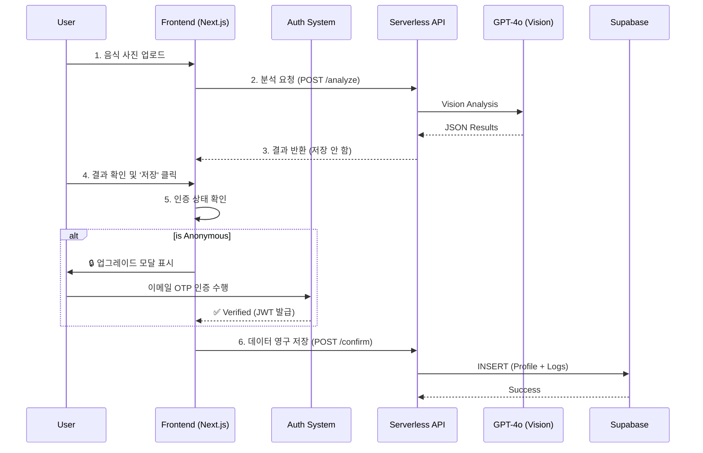

# 🥗 MealRo (MVP/Demo)

[]()
[]()
[]()

---

## 📌 TL;DR (Executive Summary)
**"가장 빠르고 투명한 식단 관리"**
MealRo는 사용자가 복잡한 회원가입 없이 즉시 식단을 기록하고, 자신의 선택에 따라 데이터를 영구히 소유할 수 있는 **2-Tier Hybrid Authentication** 시스템을 도입한 차세대 영양 분석 서비스입니다.

- **Frontend**: Next.js 14 (App Router), Tailwind CSS
- **Backend**: Supabase (PostgreSQL), RLS (Row Level Security)
- **Auth**: Passwordless Email OTP (Resend + Nodemailer Fallback), JWT (Secure HttpOnly Cookie)
- **AI Core**: OpenAI GPT-4o Vision (Food Lens)

---

## ✨ 핵심 기능 (Key Features)

### 1. Reverse Planner & Guest Mode (New!)
사용자가 가입하기 전에도 앱의 가치를 경험할 수 있는 **"선체험 후가입"** 흐름을 제공합니다.
*   **Guest Mode**: 로그인 없이도 AI 기반 맞춤 식단을 추천받을 수 있습니다.
*   **Context Aware**: 비로그인 상태임을 인지하고 "체험 모드" 배너를 표시합니다.
*   **Data Persistence**: 게스트 상태에서 생성한 식단은 `localStorage`에 임시 저장되며, 회원가입/로그인 시 자동으로 내 계정으로 복구(Restore)됩니다.

### 2. 2-Tier Authentication System
사용자 경험(UX)과 데이터 영속성을 모두 잡은 하이브리드 인증 구조입니다.

| Tier | Identifier | 접근 권한 | 데이터 저장 |
| :--- | :--- | :--- | :--- |
| **Anonymous** (익명) | `device_id` (UUID) | 메뉴 스캔, 추천, 지도 | ❌ (로컬/단기) |
| **Verified** (인증) | 이메일 (OTP) | **모든 기능** + 대시보드, 히스토리 | ✅ (영구 보관) |

*   **Upgrade Funnel**: 데이터 저장 시점에만 자연스럽게 "이메일 간편 인증"을 제안합니다.
*   **Simple Email Login**: 비밀번호 없이 이메일로 6자리 코드만 받아서 로그인합니다. (보안성 ↑, 분실 걱정 ❌)

### 3. AI Food Lens
*   **Instant Analysis**: 사진 촬영 즉시 비전 AI가 음식명과 영양소를 추정합니다.
*   **Interactive Feedback**: AI 확신도가 낮을 경우, 스마트한 후보군을 제시하여 사용자가 정답을 선택하도록 돕습니다.

---

## 🔄 시스템 아키텍처 (Architecture)



---

## 📡 API Reference

#### Authentication
*   `POST /api/auth/send-code`: 이메일로 6자리 OTP 발송 (Resend / Nodemailer)
*   `POST /api/auth/verify-code`: OTP 검증 및 세션(Cookie) 생성
*   `GET /api/auth/me`: 현재 로그인된 사용자 세션 확인

#### Core Service
*   `POST /api/analyze-image`: 이미지 분석 (Stateless)
*   `GET /api/planner/search`: 메뉴 검색 (App-side Join 최적화)
*   `POST /api/food/confirm`: 식단 데이터 최종 저장 (Auth Required)

---

## 🚀 시작하기 (Getting Started)

### 1. 환경 변수 설정
`.env.local` 파일에 다음 키들을 설정해야 합니다.

```bash
# Database (Supabase)
NEXT_PUBLIC_SUPABASE_URL=...
NEXT_PUBLIC_SUPABASE_ANON_KEY=...
SUPABASE_SERVICE_ROLE_KEY=...    # 필수: Auth 관리 및 RLS 우회용

# AI Services
OPENAI_API_KEY=sk-...            # Vision API

# Email Services (Resend recommended)
RESEND_API_KEY=re_...            # 1순위: Resend
EMAIL_FROM=onboarding@resend.dev # 발신자 주소
# GMAIL_USER=...                 # 2순위: Nodemailer (Fallback)
# GMAIL_APP_PASSWORD=...

# Security
JWT_SECRET=...                   # Min 32 chars (Secure Random)
```

### 2. 설치 및 실행

```bash
npm install
npm run dev
# 접속: http://localhost:3000
```

---

## 🧪 테스트 시나리오 (Demo Scenario)

1.  **익명 탐색**: 로그인 없이 '식단 추천(Planner)' 메뉴로 이동하여 AI 추천을 받아봅니다. ("체험 모드" 배너 확인)
2.  **데이터 저장 시도**: 추천받은 식단을 '저장'하려고 하면 로그인 모달이 뜹니다.
3.  **간편 로그인**: 이메일을 입력하고 "인증번호 받기"를 누릅니다. (스팸함 확인 팁 제공)
4.  **데이터 복구**: 로그인 성공 후, 아까 추천받았던 식단이 사라지지 않고 유지되는지 확인합니다.
5.  **영구 저장**: 이제 '저장' 버튼을 누르면 내 히스토리에 영구적으로 기록됩니다.

---

## 📚 문서 (Documentation)
*   [Product Requirements (PRD v2.0)](./PRD.md)
*   [User Walkthrough](./walkthrough.md)
*   [Sitemap](./sitemap.md)
