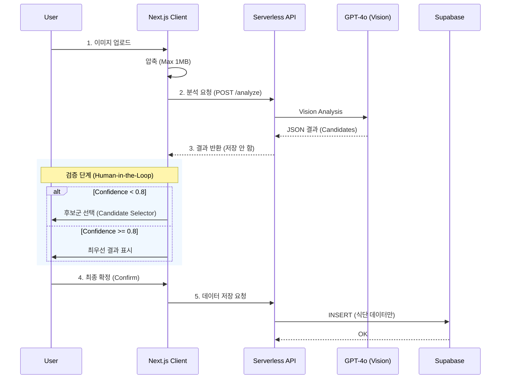

# 🥗 MealRo (MVP/Demo)

[]()
[]()
[]()

> 실제 프로덕션 환경에서의 데이터 무결성이나 의료적 정확성을 보장하지 않으며, 모든 데이터는 **익명**으로 처리되고 분석 이미지는 **즉시 폐기**됩니다.

## 📌 TL;DR
- **What**: 별도 가입 없는 익명 기반 AI 식단 기록 및 영양 분석 보조 서비스
- **Key Tech**: Next.js 14, Supabase (DB only), OpenAI GPT-4o Vision, Serverless Architecture
- **Limitations**: 클라이언트 레벨의 데이터 검증 부재, 통계적 확률에 의존하는 AI 신뢰도

---

## 🏗 프로젝트 개요 (Overview)
**MealRo**는 "내가 먹는 음식이 무엇인지 가장 빠르고 투명하게 아는 것"을 목표로 합니다.

*   **비의료용 보조 도구**: 의료적 진단이 아닌, 일상적인 식단 관리를 위한 참고 정보를 제공합니다.
*   **Privacy-First**: 민감한 식생활 데이터를 서버에 남기지 않고, 사용자가 선택한 결과만 저장합니다.
*   **투명한 AI**: AI가 100% 정확하지 않음을 인정하고, 사용자에게 최종 판단 권한(Human-in-the-Loop)을 부여합니다.

---

## ✨ 핵심 기능 (Key Features)

- [x] **AI Food Lens**: 음식 사진을 촬영/업로드하면 수 초 내에 음식명과 영양 정보 추정.
- [x] **Top-N Candidates**: AI 확신(Confidence)이 80% 미만일 경우, **Top-3 후보군**을 제시하여 사용자 선택 유도.
- [x] **Public Feed (Opt-in)**: 사용자가 동의한 기록만 익명으로 집계하여 "다른 사람들의 식단" 공유 (Privacy Preserved).
- [x] **Deferred Logging**: 사용자가 '저장(Confirm)' 버튼을 누르기 전까지는 서버에 로그를 남기지 않음.
- [x] **Privacy by Design**: 업로드된 이미지는 분석 즉시 메모리에서 소멸 (No Storage).

---

## 🔄 시스템 흐름 (Architecture)

이미지 업로드부터 데이터 저장까지의 데이터 흐름입니다. **이미지 파일은 절대 저장되지 않습니다.**



---

## 🔒 데이터 & 개인정보 처리 (Data Policy)

| 항목 | 처리 방식 | 비고 |
| :--- | :--- | :--- |
| **음식 이미지** | **즉시 폐기** | 분석 전용, 스토리지 저장 X |
| **사용자 ID** | **익명 (Anonymous)** | `localStorage` 기반 UUID 생성 |
| **식단 데이터** | **선택적 저장** | '저장' 버튼 클릭 시에만 DB 기록 |
| **민감 정보** | **수집 안 함** | 이메일, 전화번호, 위치 등 수집 X |

---

## 📡 API 요약 (Technical)

| Method | Endpoint | Description |
| :--- | :--- | :--- |
| `POST` | `/api/analyze-image` | 이미지를 분석하여 JSON 결과 반환 (Stateless) |
| `POST` | `/api/food/confirm` | 확정된 식단 데이터를 DB에 기록 |

<details>
<summary><b>🔎 분석 결과 JSON 예시 (펼치기)</b></summary>

```json
{
  "food_name": "김치찌개",
  "confidence": 0.85,
  "nutrition": {
    "calories": 450,
    "protein": 20,
    "carbohydrates": 15,
    "fat": 10
  },
  "candidates": [
    { "food_name": "부대찌개", "reasoning": "햄 유사 물체 식별" }
  ]
}
```
</details>

---

## ⚠️ 한계 및 리스크 (Limitations & Risks)

본 데모 버전 사용 및 코드 리뷰 시 반드시 인지해야 할 사항입니다.

### 1. 보안 및 무결성 (Security)
*   **Client-Side Payload**: 현재 최종 저장 API(`confirm`)는 클라이언트가 보낸 데이터를 그대로 신뢰합니다. 악의적인 사용자가 영양 성분을 조작하여 보낼 수 있습니다.
*   **Protection**: 데모 환경에서는 Rate Limiting이나 Replay Attack 방지 로직이 적용되지 않았습니다.

### 2. AI 신뢰성 (Model Reliability)
*   **Confidence Score**: AI가 반환하는 0.0~1.0 점수는 모델의 토큰 생성 확률일 뿐, 실제 정답 확률과 통계적으로 일치하지 않습니다 (Not Calibrated).
*   **Threshold (0.8)**: 내부 테스트를 통해 설정한 경험적 수치(Heuristic)입니다.

---

## 🛡 보안 & 컴플라이언스 상태

- [x] **익명화 처리**: 모든 데이터는 난수화된 ID로 관리됨
- [x] **최소 수집 원칙**: 기능 구현에 불필요한 정보 요구 안 함
- [x] **AI 고지**: "생성형 AI" 사용 사실 명시 (UI 배지, 하단 문구)
- [ ] **데이터 무결성 검증**: 서버 사이드 세션 검증 (Top Priority for Prod)
- [ ] **서비스 이용 약관**: 법적 검토 미완료 (`TODO` 상태)

---

## 🚀 로컬 실행 (Getting Started)

### 1. 환경 변수 설정
`.env.local` 파일을 생성하고 키를 입력하세요.

```bash
NEXT_PUBLIC_SUPABASE_URL=your_supabase_url
NEXT_PUBLIC_SUPABASE_ANON_KEY=your_anon_key
OPENAI_API_KEY=sk-...
```

### 2. 설치 및 실행

```bash
npm install
npm run dev
# 접속: http://localhost:3000
```

---

## 🧪 Demo 시나리오 (For Reviewers)

1.  **홈 화면**: '음식 스캔' 버튼 클릭
2.  **이미지 업로드**: 복잡한 찌개류 또는 여러 반찬이 있는 사진 업로드
3.  **로딩 UX**: "AI가 분석 중..." 타이핑 효과 확인
4.  **검증 로직**:
    *   (AI 확신 시) 결과 카드 즉시 표시
    *   (AI 불확신 시) "이 음식이 맞나요?" 후보군 선택지 표시
5.  **저장**: 결과 확인 후 '저장' 버튼 클릭 → SnackBar 피드백 확인

---

## 📚 References
*   [AI System Audit Report](./audit_report.md)
*   [User Walkthrough](./walkthrough.md)
*   Supabase Documentation
*   OpenAI Vision API Guide
