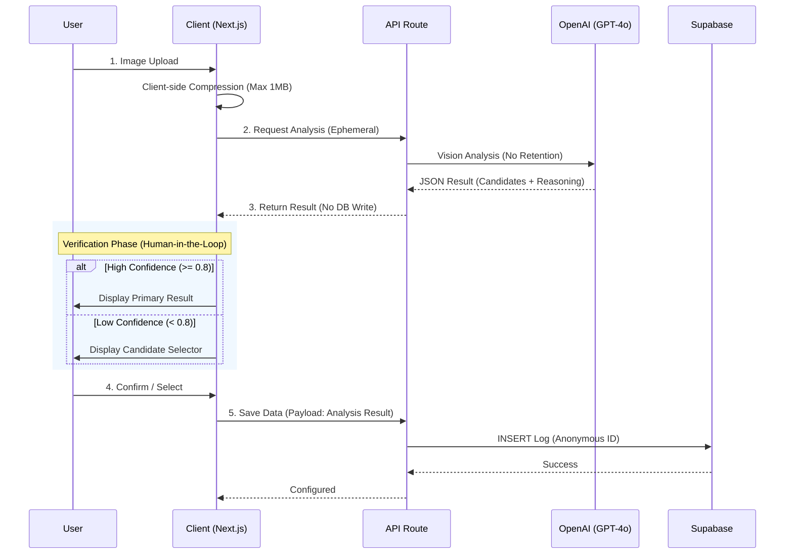

# MealRo Project Technical Documentation

> **Status**: MVP / Technical Demo  
> **Target Audience**: Technical Reviewers, Auditors, Contributors  
> **License**: Private / Proprietary (Demo Use Only)

---

## 1. MealRo 소개 (Introduction)

**MealRo**는 사용자가 섭취하는 음식 이미지를 AI로 분석하여 영양 정보를 추정하고, 이를 기반으로 참고용 식단 정보를 제공하는 **비의료용 식사 인식 보조 서비스**입니다.


### 핵심 원칙
1.  **익명성 (Anonymity)**: 별도의 회원가입이나 로그인 절차 없이 로컬 식별자(Local Identifier)만을 사용하여 서비스를 이용합니다.
2.  **비저장 원칙 (No-Storage)**: 사용자가 업로드한 음식 이미지는 AI 분석 직후 메모리에서 즉시 폐기되며, 서버나 데이터베이스에 영구 저장되지 않습니다.
3.  **사용자 주권 (User Confirmation)**: AI의 분석 결과는 사용자가 명시적으로 '저장(Save)' 버튼을 누르기 전까지는 어떠한 로그로도 기록되지 않습니다.

---

## 2. 주요 기능 (Key Features)

### 2.1 AI Food Image Recognition
-   **Model**: OpenAI GPT-4o (Vision)
-   **Process**: 고해상도 이미지를 분석하여 음식명, 재료, 추정 칼로리 및 영양소(탄/단/지)를 구조화된 JSON 데이터로 추출합니다.
-   **Reasoning**: 단순 분류(Classification)가 아닌, 시각적 특징(색상, 질감, 그릇 형태)에 기반한 **Chain of Thought(CoT)** 추론 과정을 수행합니다.

### 2.2 Multi-Candidate Selection (Human-in-the-Loop)
-   **Problem**: 생성형 AI는 확률적 모델이므로 오인식(Hallucination) 가능성이 존재합니다.
-   **Solution**: AI 신뢰도(Confidence Score)가 내부 임계값(**0.8**) 미만일 경우, 단일 결과를 강제하지 않고 **Top-3 후보군**을 제시하여 사용자가 직접 선택하도록 유도합니다. 이를 통해 오분류 리스크를 UX 단계에서 완화합니다.

### 2.3 AI Transparency Notice
-   프로덕트 전반에 걸쳐 본 결과가 **"Generative AI"**에 의해 생성되었음을 명시하는 배지와 고지문(Disclaimer)을 배치하여, 사용자가 AI의 한계를 인지할 수 있도록 설계되었습니다. (AI Basic Act 준수 지향)

---

## 3. 시스템 아키텍처 개요 (System Architecture)

본 서비스는 클라이언트(Next.js) 중심의 Stateless 아키텍처를 지향합니다.



-   **Frontend**: Next.js 14 (App Router), TypeScript, TailwindCSS
-   **Backend**: Supabase (PostgreSQL), Next.js Server Actions
-   **AI Engine**: OpenAI API (Stateless invocation)

---

## 4. 프라이버시 및 데이터 처리 정책 (Privacy & Data Handling)

본 서비스는 **Privacy by Design** 원칙에 따라 설계되었습니다.

1.  **이미지 처리**: 업로드된 이미지는 Base64 형태로 변환되어 AI 모델 추론에만 사용되며, **분석 완료 즉시 휘발**됩니다. 별도의 스토리지(S3, Supabase Storage 등)를 사용하지 않습니다.
2.  **데이터 로깅**: 사용자의 명시적 '저장' 행위 없이는 어떠한 분석 데이터도 DB에 남지 않습니다. (Default Logging OFF)
3.  **개인정보**: 사용자 식별은 브라우저의 `localStorage`에 저장된 익명 UUID만을 사용하며, 이메일/전화번호 등 민감 정보를 수집하지 않습니다.

---

## 5. AI 투명성 및 한계 고지 (AI Transparency & Limitations)

*   **Technology**: 본 서비스는 **생성형 AI (Generative AI)** 기술을 활용합니다.
*   **Accuracy**: AI가 제공하는 영양 정보는 시각적 추론에 기반한 **추정치(Estimate)**이며, 실제 식품의 영양 성분표와 다를 수 있습니다.
*   **Confidence Score**: 제공되는 신뢰도 점수는 모델의 토큰 생성 확률에 기반한 값으로, 통계적 정답 확률을 절대적으로 보장하지 않습니다.

---

## 6. Known Limitations (알려진 한계 - Demo 기준)

본 감사는 Demo/MVP 버전을 기준으로 수행되었으며, 다음과 같은 기술적 한계가 존재합니다.

1.  **Client-Side Data Integrity**: 현재 구조에서는 클라이언트가 최종 확정된 영양 정보를 서버로 전송합니다 (`/api/food/confirm`). 악의적인 사용자가 API를 조작하여 허위 데이터를 전송할 수 있는 리스크가 존재합니다. (Server-side Session Caching 미적용)
2.  **Uncalibrated Threshold**: UX 분기 임계값(`0.8`)은 예비 테스트를 통해 설정된 경험적 수치(Heuristic)이며, 대규모 데이터셋을 통한 보정(Calibration)이 수행되지 않았습니다.
3.  **No Rate Limiting**: 데모 편의성을 위해 API 호출 제한(Rate Limiting)이 적용되지 않았습니다.

---

## 7. Audit & Validation 요약

내부 기술 감사(Technical Audit) 결과, 본 시스템은 **Demo Release 적합(Go)** 판정을 받았습니다.

*   **Strengths**: 사용자 프라이버시 보호 구조 우수, AI 투명성 고지 적절함.
*   **Risks**: 데이터 무결성 검증 로직 부재 (Analytics 신뢰도 낮음).
*   **Verdict**: MVP 목적의 기능 시연 및 UX 검증에는 적합하나, 프로덕션 상용화 시 아키텍처 보완 필요.

---

## 8. 향후 개선 계획 (Roadmap for Production)

상용 서비스 전환 시 다음 항목들이 보완될 예정입니다.

1.  **Server-side Validation**: 분석 결과를 서버 세션(Redis 등)에 캐싱하고, 사용자 확인 시 클라이언트 페이로드가 아닌 캐시된 데이터를 커밋하여 무결성 확보.
2.  **Confidence Calibration**: 실제 사용자 피드백(Accept/Reject) 데이터를 기반으로 신뢰도 점수 보정.
3.  **Security Hardening**: API Rate Limiting, Replay Attack 방지, WAF 적용.
4.  **Database Scalability**: 시계열 데이터 최적화 및 파티셔닝.

---

## 9. 법적/의료적 고지 (Legal & Medical Disclaimer)

> **주의**: 본 서비스는 의료 기기가 아닙니다.

*   본 서비스가 제공하는 정보는 사용자의 건강 관리를 돕기 위한 **참고 자료**일 뿐이며, 의학적 진단, 치료, 처방을 대체할 수 없습니다.
*   알레르기, 당뇨 등 식이 조절이 필수적인 질환자의 경우, 반드시 전문의 상담 및 실제 제품 라벨을 확인해야 합니다.
*   `TODO(LEGAL_REVIEW)`: 서비스 이용 약관 및 개인정보 처리방침에 대한 법률 전문가의 검토가 필요합니다.

---

## Appendix: Technical Setup (For Developers)

### Prerequisites
- Node.js 18+
- Supabase Project
- OpenAI API Key

### Installation

```bash
# 1. Install dependencies
npm install

# 2. Environment Setup (.env.local)
NEXT_PUBLIC_SUPABASE_URL=...
NEXT_PUBLIC_SUPABASE_ANON_KEY=...
OPENAI_API_KEY=...

# 3. Database Migration
# Run SQLs in /supabase/migrations

# 4. Run Dev Server
npm run dev
```

### Project Structure
```
src/
├── app/api/food/confirm/  # Deferred Logging Endpoint
├── components/
│   ├── FoodScanner.tsx    # Main Vision Logic
│   └── CandidateSelector.tsx # Human-in-the-Loop UI
└── lib/openai-analyzer.ts # CoT Prompt Engineering
```
