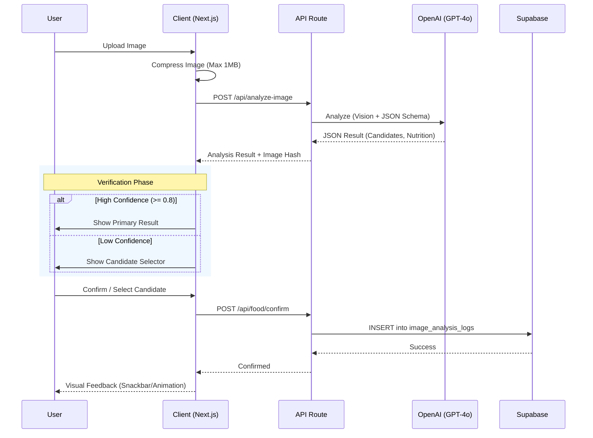

# MealRo

건강한 아침/점심/저녁 끼니를 추천하는 MVP 서비스입니다.

> ⚠️ **확실하지 않음**: 일부 항목은 PRD에서 확정되지 않아 추측으로 구현되었습니다. 아래 "Known Limitations" 섹션을 확인하세요.

## Tech Stack

- **Frontend**: Next.js 14 (App Router) + TypeScript + TailwindCSS
- **Backend**: Supabase (PostgreSQL + Auth-less anonymous tracking)
- **AI**: OpenAI GPT-4o (Vision) for high-precision food analysis
- **Hosting**: Vercel (optional)

## Quick Start

### 1. Install Dependencies

```bash
npm install
```

### 2. Configure Environment

Copy `.env.example` to `.env.local` and fill in your Supabase credentials:

```bash
cp .env.example .env.local
```

Edit `.env.local`:
```env
NEXT_PUBLIC_SUPABASE_URL=your_supabase_project_url
NEXT_PUBLIC_SUPABASE_ANON_KEY=your_supabase_anon_key
```

### 3. Set Up Database

1. Create a new Supabase project at [supabase.com](https://supabase.com)
2. Go to SQL Editor and run the migration files in order:
   - `supabase/migrations/001_initial_schema.sql` (creates tables, indexes, RLS policies)
   - `supabase/migrations/002_seed_data.sql` (sample data for development)

### 4. Run Development Server

```bash
npm run dev
```

Open [http://localhost:3000](http://localhost:3000) in your browser.

## Available Scripts

```bash
npm run dev       # Start development server
npm run build     # Build for production
npm run start     # Start production server
npm run lint      # Run ESLint
npm run typecheck # Run TypeScript type checking
```

## Project Structure

```
MealRo/
├── src/
│   ├── app/                    # Next.js App Router pages
│   │   ├── layout.tsx          # Root layout
│   │   ├── page.tsx            # Home page
│   │   ├── meal/               # Meal recommendation list
│   │   ├── item/[id]/          # Item detail
│   │   │   └── go/             # Bridge page (external link)
│   │   ├── disclaimer/         # Disclaimer page
│   │   └── about/              # About page
│   ├── components/             # React components
│   │   ├── MealTabs.tsx        # 아침/점심/저녁 tabs
│   │   ├── RecoCard.tsx        # Recommendation card
│   │   ├── GradeBadge.tsx      # Grade with dual-coding
│   │   ├── FilterChips.tsx     # Category filters
│   │   ├── SkeletonCard.tsx    # Loading skeleton
│   │   ├── Snackbar.tsx        # Action feedback
│   │   └── EmptyState.tsx      # Empty state
│   ├── lib/                    # Utilities
│   │   ├── supabase/           # Supabase clients & types
│   │   ├── analytics.ts        # Event tracking
│   │   ├── grade.ts            # Grade computation
│   │   └── userId.ts           # Anonymous user ID
│   └── styles/
│       └── globals.css         # Global styles
├── supabase/
│   └── migrations/             # SQL migrations
├── .env.example
├── package.json
└── README.md
```

## Routes

| Route | Description |
|-------|-------------|
| `/` | 홈 - 서비스 소개 및 메인 액션 |
| `/meal` | 끼니별 추천 리스트 |
| `/scan` | 음식 촬영 및 AI 영양 분석 |
| `/item/[id]` | 음식 상세 정보 |
| `/item/[id]/go` | 브릿지 페이지 (외부 링크 전 고지) |
| `/disclaimer` | 면책조항 |
| `/about` | 서비스 소개 |

## Analytics Events

| Event | Description |
|-------|-------------|
| `page_view` | 페이지 조회 |
| `meal_selected` | 끼니 탭 선택 |
| `item_impression` | 카드 화면 노출 |
| `item_click` | 카드 클릭 |
| `bridge_view` | 브릿지 페이지 진입 |
| `external_link_click` | 외부 링크 클릭 |
| `filter_applied` | 필터 적용 |
| `excluded_item_encountered` | 제외 항목 조회 시도 |

## Grade System

| Grade | Criteria | Icon |
|-------|----------|------|
| A | 단백질 비율 ≥4%, 칼로리 ≤500kcal | 🌟 |
| B | 단백질 비율 ≥3%, 칼로리 ≤600kcal | 👍 |
| C | 단백질 비율 ≥2% | ➖ |
| D | 기타 | ⚠️ |

> 등급은 100g당 단백질/칼로리 비율 기반 참고 지표입니다.

## PRD Coverage Checklist

| PRD Requirement | Status | Implementation |
|-----------------|--------|----------------|
| 익명 사용 (로그인 없음) | ✅ | localStorage 기반 anonymous_user_id |
| 아침/점심/저녁 | ✅ | MealTabs 컴포넌트 |
| Supabase 사용 | ✅ | @supabase/ssr, type-safe client |
| 음식군 평균 영양값 | ✅ | nutrition_group_avg 테이블 |
| 추정치 면책 문구 | ✅ | 모든 관련 페이지에 표시 |
| 제외 항목 정책 | ✅ | is_allowed=false, 내부 로깅만 |
| 브릿지 페이지 | ✅ | /item/[id]/go, 고지문 표시 |
| 듀얼 코딩 (색상+아이콘) | ✅ | GradeBadge 컴포넌트 |
| 8pt 그리드 spacing | ✅ | tailwind.config.ts |
| 이벤트 로깅 | ✅ | events 테이블, 8개 이벤트 타입 |
| RLS 정책 | ✅ | 읽기: 공개, 쓰기: events만 공개 |
| 스켈레톤 로딩 | ✅ | SkeletonCard 컴포넌트 |
| 빈 상태 | ✅ | EmptyState 컴포넌트 |
| 필터 | ✅ | FilterChips (카테고리) |
| 외부 링크 처리 | ✅ | 네이버 쇼핑 검색 링크 |
| AI 음식 스캔 | ✅ | OpenAI GPT-4o Vision, 고화질 분석 지원 |

## Known Limitations / 확실하지 않음

| Item | Status | Note |
|------|--------|------|
| 영양값 단위 | ⚠️ 추측 | per 100g 기준으로 구현. PRD에서 단위 확정 필요. |
| 등급 산정 기준 | ⚠️ 추측 | 단백질 비율 + 칼로리 기반. 영양학적 검토 필요. |
| 제휴 고지 문구 | ⚠️ TODO | `TODO(LEGAL_REVIEW)` - 공정위 가이드 확인 필요 |
| 의료 면책 문구 | ⚠️ TODO | `TODO(LEGAL_REVIEW)` - 법무 검토 필요 |
| 쿠팡 링크 방식 | ⚠️ 변경 | 네이버 쇼핑 검색 링크로 구현 (제휴 없음) |
| 실데이터 | ⚠️ 필요 | 샘플 seed 데이터만 포함. 실제 데이터 교체 필요. |

## Legal TODO

코드 내 `TODO(LEGAL_REVIEW)` 주석을 검색하여 법적 검토가 필요한 부분을 확인하세요:

```bash
grep -r "TODO(LEGAL_REVIEW)" src/
```

## License

Private - All rights reserved.

## System Flow & Architecture

### Food Analysis & Logging Flow



### Key Components

1.  **Scanner Component (`FoodScanner.tsx`)**: Handles image input, compression, and manages the multi-step analysis flow.
2.  **Analysis Logic (`openai-analyzer.ts`)**: specialized prompt engineering to extract structured JSON data including multiple candidates.
3.  **Deferred Logging**: Analysis results are not logged immediately. They are only saved to Supabase when the user **confirms** the result, ensuring higher data quality.

