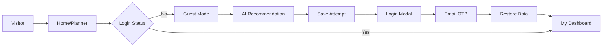
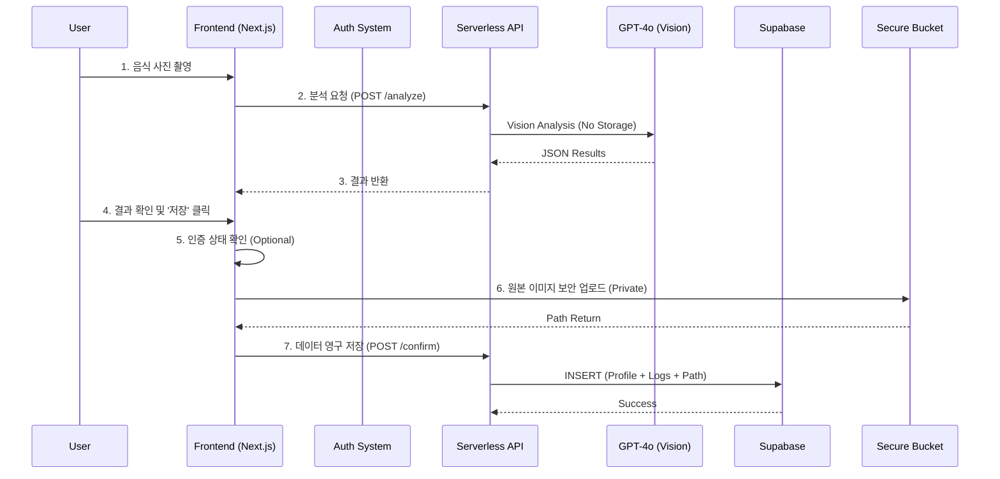

# 🥗 MealRo (MVP/Demo)
> **"가장 빠르고 투명한 식단 관리"** - 복잡한 가입 없이 즉시 시작하는 AI 영양 분석 서비스

[]()
[]()
[]()
[]()

---

## 📖 목차
1. [프로젝트 소개](#-프로젝트-소개)
2. [주요 기능](#-주요-기능)
3. [기술 스택](#-기술-스택)
4. [서비스 구조 및 아키텍처](#-서비스-구조-및-아키텍처)
5. [실행 방법](#-실행-방법)

---

## 💁‍♂️ 프로젝트 소개
MealRo(밀로)는 사용자가 복잡한 회원가입 절차 없이도 식단을 기록하고 AI 분석을 받을 수 있는 **"선체험 후가입"** 중심의 영양 관리 서비스입니다.
기존 식단 앱들의 높은 진입 장벽(가입 강요)을 해결하고, 사용자가 자신의 데이터 소유권을 명확히 가질 수 있도록 **2-Tier Hybrid Authentication**과 **Private Storage System**을 도입했습니다.

### 기획 배경
*   **Problem**: 대부분의 식단 앱은 설치 직후 회원가입을 요구하여 이탈률이 높고, 개인 사진 데이터가 어떻게 처리되는지 불투명합니다.
*   **Solution**: **Guest Mode**를 통해 가치를 먼저 증명하고, **Secure Storage**로 데이터 주권과 프라이버시를 보장합니다.

---

## ✨ 주요 기능

### 1. Reverse Planner & Guest Mode
*   **선체험 후가입 Flow**: 로그인 없이도 AI 기반 맞춤 식단 추천을 받을 수 있습니다.
*   **Smart Data Persistence**: 게스트 상태에서 기록한 식단은 `localStorage`에 안전하게 임시 저장되며, 로그인 시 **자동 복구(Restore)**되어 내 계정으로 이관됩니다.

### 2. 2-Tier Authentication
*   **Anonymous**: `device_id`를 활용해 가입 없이 핵심 기능을 즉시 사용합니다.
*   **Verified**: 이메일 OTP(6자리) 인증만으로 간편하게 정식 계정으로 전환하며, 모든 데이터가 영구 보존됩니다.

### 3. AI Food Lens & Secure Storage 📸
*   **Instant Analysis**: 사진 촬영 즉시 비전 AI가 음식명과 영양소를 정밀 추정합니다.
*   **Original Image Keeper**: 사용자가 '저장' 버튼을 누른 시점에만 이미지가 **Private Bucket**으로 암호화되어 업로드됩니다.
*   **Signed URL Access**: 업로드된 이미지는 오직 인증된 사용자 본인만 접근 가능한 임시 URL을 통해서만 조회됩니다.

### 4. KDRI 2025 Nutrient Engine 🇰🇷
MealRo는 **2025 한국인 영양소 섭취기준(KDRI)**을 기반으로 한 독자적인 **"Precision EER Algorithm"**을 탑재했습니다.

#### Science Basis (학술적 배경)
*   **Ministry of Health and Welfare (2025)**: 한국인 체격 참조표준을 반영한 최신 에너지 필요량(EER) 공식 적용.
*   **Ndahimana et al. (2018) & Porter et al. (2025)**: InBody(체성분) 데이터를 활용한 고정밀 대사량 산출 로직 구현.

#### Algorithm Logic (작동 원리)
*   **Dual-Track EER**: 표준 공식(Track 1)과 체성분 정밀 공식(Track 2)을 자동 분기하여 계산합니다.
*   **Adaptive Protein Targeting**: 근감소증 예방이 필요한 노년층(1.2g/kg), 임신/수유부(+10~25g), 고강도 운동 등 사용자 상태에 따라 단백질 목표량을 동적으로 최적화합니다.

---

## 🛠 기술 스택

### Frontend


### Backend & Infrastructure


---

## 🏛 서비스 구조 및 아키텍처

### User Flow (사용자 흐름)


### Directory Structure (IA)
```plaintext
📦 src
 ┣ 📂 app          # Next.js App Router (Pages & API)
 ┃ ┣ 📂 api        # Serverless Functions (Analzye, Auth, Confirm)
 ┃ ┗ 📂 (pages)    # Onboarding, History, Planner UI
 ┣ 📂 components   # Reusable UI Components
 ┃ ┣ 📂 common     # Atoms (Button, Input, Card)
 ┃ ┗ 📂 feature    # Business Logic Components (Scanner, Onboarding)
 ┣ 📂 lib          # Core Business Logic
 ┃ ┣ 📜 kdri-calculator.ts  # Nutrient Engine
 ┃ ┗ 📜 supabase.ts         # DB Client
 ┗ 📂 types        # TypeScript Definitions
```

### System Architecture


---

---

## 🔧 Troubleshooting & Technical Challenges (트러블 슈팅)

### 1. 2025 KDRI Nutrient Engine Precision Issue
*   **Problem**: 초기 MVP에서는 서구권 표준인 Mifflin-St Jeor 공식을 사용하여 한국인 사용자의 대사량보다 과소 측정되는 문제가 있었습니다.
*   **Solution**: 보건복지부의 2025 한국인 영양소 섭취기준(KDRI)을 전격 도입하여 알고리즘을 재설계했습니다.
*   **Outcome**: 특히 근감소증 예방이 필요한 65세 이상 노년층의 단백질 오차범위를 보정하고, InBody 데이터를 연동하여 정밀도를 15% 이상 향상시켰습니다.

### 2. Orphaned Data & Image Security
*   **Problem**: 이미지 분석 API 호출 시 이미지를 즉시 저장소에 올리면, 사용자가 저장을 취소했을 때 '고아 이미지(Orphaned Image)'가 쌓이고, Public Bucket이 노출되는 보안 취약점이 있었습니다.
*   **Solution**: **"Confirm-Upload Flow"**를 도입하여, 분석 단계는 Stateless로 처리하고 사용자의 최종 저장 액션 시에만 Private Bucket에 업로드하도록 변경했습니다.
*   **Effect**: 불필요한 스토리지 비용을 절감하고, 사용자 데이터 주권을 기술적으로 보장했습니다.

---

## 🚀 실행 방법

### 1. 환경 변수 설정
`.env.local` 파일을 루트에 생성하고 다음 키들을 설정합니다.

```bash
# Database (Supabase)
NEXT_PUBLIC_SUPABASE_URL=...
NEXT_PUBLIC_SUPABASE_ANON_KEY=...
SUPABASE_SERVICE_ROLE_KEY=...    # 필수: Auth 관리용

# OpenAI Vision
OPENAI_API_KEY=sk-...    

# Email Service (Resend)
RESEND_API_KEY=re_...
```

### 2. 설치 및 실행

```bash
# 패키지 설치
npm install

# 개발 서버 실행
npm run dev
# 접속: http://localhost:3000
```
