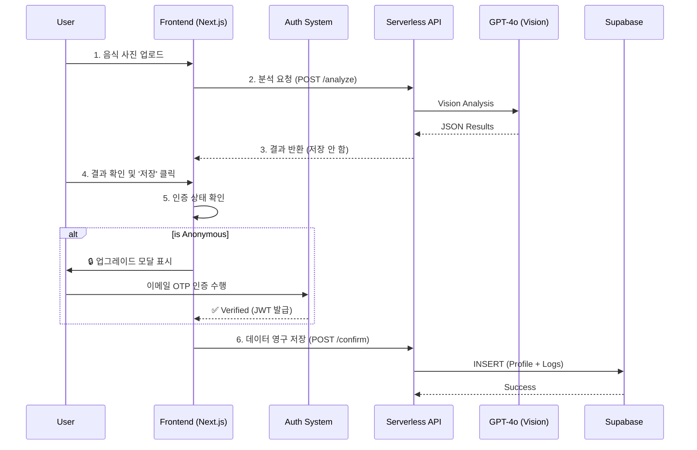

# 🥗 MealRo (MVP/Demo)

[]()
[]()
[]()

> 실제 프로덕션 환경에서의 데이터 무결성이나 의료적 정확성을 보장하지 않으며, 모든 데이터는 **익명 가명화** 처리되어 관리됩니다.

---

## 📌 TL;DR (Executive Summary)
**"가장 빠르고 투명한 식단 관리"**
MealRo는 사용자가 복잡한 회원가입 없이 즉시 식단을 기록하고, 자신의 선택에 따라 데이터를 영구히 소유할 수 있는 **2-Tier Hybrid Authentication** 시스템을 도입한 차세대 영양 분석 서비스입니다.

- **Frontend**: Next.js 14 (App Router), Tailwind CSS
- **Backend & Auth**: Supabase (PostgreSQL), SendGrid (Email OTP), JWT (Secure Session)
- **AI Core**: OpenAI GPT-4o Vision (Food Lens)

---

## ✨ 핵심 기능 (Key Features)

### 1. 2-Tier Authentication System
사용자 경험(UX)과 데이터 영속성을 모두 잡은 하이브리드 인증 구조입니다.

| Tier | Identifier | 접근 권한 | 데이터 저장 |
| :--- | :--- | :--- | :--- |
| **Anonymous** (익명) | `device_id` (UUID) | 메뉴 스캔, 추천, 지도 | ❌ (로컬 임시) |
| **Verified** (인증) | 이메일 (OTP) | **모든 기능** + 대시보드, 히스토리 | ✅ (영구 보관) |

*   **Upgrade Funnel**: 사용자가 데이터를 "저장"하려고 할 때만 자연스럽게 가입을 유도합니다 (`UpgradePromptModal`).
*   **Privacy Lock**: 익명 상태에서는 대시보드 및 히스토리 접근이 🔒 잠금 처리됩니다.

### 2. AI Food Lens
*   **Instant Analysis**: 사진 촬영 즉시 비전 AI가 음식명과 영양소를 추정합니다.
*   **Candidate Selection**: AI 확신도(Confidence)가 낮을 경우, 스마트한 후보군을 제시하여 사용자가 정답을 선택하도록 돕습니다(Human-in-the-Loop).

### 3. Secure by Design
*   **HttpOnly Cookie**: JWT 토큰을 클라이언트가 접근 불가능한 보안 쿠키로 관리하여 XSS 공격을 방지합니다.
*   **No Image Storage**: 분석에 사용된 이미지는 즉시 폐기되며 서버에 저장되지 않습니다.

---

## 🔄 시스템 아키텍처 (Architecture)



---

## 📡 API Reference

#### Authentication
*   `POST /api/auth/send-code`: 이메일로 6자리 OTP 발송 (SendGrid)
*   `POST /api/auth/verify-code`: OTP 검증 및 세션(Cookie) 생성
*   `GET /api/auth/me`: 현재 로그인된 사용자 세션 확인

#### Core Service
*   `POST /api/analyze-image`: 이미지 분석 (Stateless)
*   `POST /api/food/confirm`: 식단 데이터 최종 저장 (Auth Required)

---

## 🚀 시작하기 (Getting Started)

### 1. 환경 변수 설정
`.env.local` 파일에 다음 키들을 설정해야 합니다.

```bash
# Database
NEXT_PUBLIC_SUPABASE_URL=...
NEXT_PUBLIC_SUPABASE_ANON_KEY=...
SUPABASE_SERVICE_ROLE_KEY=...    # 필수: Auth 관리용

# External Services
OPENAI_API_KEY=sk-...            # Vision API
SENDGRID_API_KEY=SG....          # Email Sending

# Security
JWT_SECRET=...                   # Min 32 chars
EMAIL_FROM=noreply@yourdomain.com
```

### 2. 설치 및 실행

```bash
npm install
npm run dev
# 접속: http://localhost:3000
```

---

## 🧪 테스트 시나리오 (Demo Scenario)

1.  **익명 탐색**: 로그인 없이 앱을 실행하고 음식 탭, 지도 탭을 자유롭게 탐색합니다.
2.  **스캔 및 차단**: 음식을 스캔하고 저장을 시도하거나, '대시보드' 탭을 클릭하여 🔒 잠금 모달이 뜨는지 확인합니다.
3.  **이메일 인증**: 모달에서 이메일을 입력하고 OTP(인증번호)를 받아 입력합니다.
4.  **데이터 클레임**: 인증이 완료되면 자동으로 이전의 익명 활동 데이터가 내 계정으로 귀속됩니다.
5.  **영구 저장**: 이제 대시보드에서 나의 영양 통계를 확인할 수 있습니다.

---

## 📚 문서 (Documentation)
*   [Product Requirements (PRD v2.0)](./PRD.md)
*   [User Walkthrough](./walkthrough.md)
*   [Sitemap](./sitemap.md)
