# 🥗 MealRo (MVP/Demo)

[]()
[]()
[]()

> 실제 프로덕션 환경에서의 데이터 무결성이나 의료적 정확성을 보장하지 않으며, 모든 데이터는 **익명**으로 처리되고 분석 이미지는 **즉시 폐기**됩니다.

## 📌 TL;DR
- **What**: 별도 가입 없는 익명 기반 AI 식단 기록 및 영양 분석 보조 서비스
- **Key Tech**: Next.js 14, Supabase (DB only), OpenAI GPT-4o Vision, Serverless Architecture
- **Limitations**: 클라이언트 레벨의 데이터 검증 부재, 통계적 확률에 의존하는 AI 신뢰도

---

## 🏗 프로젝트 개요 (Overview)
**MealRo**는 "내가 먹는 음식이 무엇인지 가장 빠르고 투명하게 아는 것"을 목표로 합니다.

*   **비의료용 보조 도구**: 의료적 진단이 아닌, 일상적인 식단 관리를 위한 참고 정보를 제공합니다.
*   **Privacy-First**: 민감한 식생활 데이터를 서버에 남기지 않고, 사용자가 선택한 결과만 저장합니다.
*   **투명한 AI**: AI가 100% 정확하지 않음을 인정하고, 사용자에게 최종 판단 권한(Human-in-the-Loop)을 부여합니다.

---

## ✨ 핵심 기능 (Key Features)


- [x] **2-Tier Auth System**: 익명(Anonymous) 탐색 후 이메일 인증(Verified)을 통한 계정 업그레이드.
    - **Anonymous**: `device_id` 기반 임시 ID 사용, 데이터 로컬 관리.
    - **Verified**: SendGrid 이메일 OTP(6자리) 인증, Custom JWT 세션, 데이터 영구 저장 및 동기화.
- [x] **Secure Session**: HttpOnly, Secure 쿠키 기반의 세션 관리로 XSS 방지.
- [x] **AI Food Lens**: 음식 사진을 촬영/업로드하면 수 초 내에 음식명과 영양 정보 추정.
- [x] **Top-N Candidates**: AI 확신(Confidence)이 80% 미만일 경우, **Top-3 후보군**을 제시하여 사용자 선택 유도.
- [x] **Public Feed (Opt-in)**: 사용자가 동의한 기록만 익명으로 집계하여 "다른 사람들의 식단" 공유.
    - **Timezone**: 모든 기록은 **한국 표준시(KST)** 기준으로 저장 및 표시 (`YYYY.MM.DD.(ddd).HH:mm`).
    - **Grouping**: 한 끼 식사(동일 시간대)에 포함된 여러 음식은 하나의 카드로 묶어서 시각화.
    - **Privacy**: 이미지 저장 없음, 사용자 식별자 비공개.
- [x] **Deferred Logging**: 사용자가 '저장(Confirm)' 버튼을 누르기 전까지는 서버에 로그를 남기지 않음.
- [x] **Privacy by Design**: 업로드된 이미지는 분석 즉시 메모리에서 소멸 (No Storage).

---

## 🔄 시스템 흐름 (Architecture)

이미지 업로드부터 데이터 저장까지의 데이터 흐름입니다. **이미지 파일은 절대 저장되지 않습니다.**

```mermaid
sequenceDiagram
    participant User
    participant Client as Next.js Client
    participant Auth as Auth System
    participant API as Serverless API
    participant AI as GPT-4o (Vision)
    participant DB as Supabase

    User->>Client: 1. 이미지 업로드
    Client->>Client: 압축 (Max 1MB)
    Client->>API: 2. 분석 요청 (POST /analyze)
    API->>AI: Vision Analysis
    AI-->>API: JSON 결과 (Candidates)
    API-->>Client: 3. 결과 반환 (저장 안 함)
    
    rect rgb(240, 248, 255)
        Note over Client, User: 검증 단계 (Human-in-the-Loop)
        alt Confidence < 0.8
            Client->>User: 후보군 선택 (Candidate Selector)
        else Confidence >= 0.8
            Client->>User: 최우선 결과 표시
        end
    end

    User->>Client: 4. 최종 확정 (Confirm)
    Client->>Auth: 5. 인증 확인 (Anonymous/Verified)
    alt is Anonymous
        Auth-->>Client: 업그레이드 유도 (Modal)
        Client->>User: 회원가입/로그인 요청
    else is Verified
        Client->>API: 6. 데이터 저장 요청 (POST /confirm)
        API->>DB: INSERT (식단 데이터 + UserID)
        DB-->>API: OK
    end
```



---

## 🔒 데이터 & 개인정보 처리 (Data Policy)

| 항목 | 처리 방식 | 비고 |
| :--- | :--- | :--- |
| **음식 이미지** | **즉시 폐기** | 분석 전용, 스토리지 저장 X |
| **사용자 ID** | **Hybrid (Anon/Verified)** | 초기 `device_id` 사용 → 이메일 인증 시 영구 계정 연결 |
| **인증 정보** | **Secure Cookie** | JWT (HttpOnly) 저장, 클라이언트 접근 불가 |
| **식단 데이터** | **선택적 저장** | '저장' 버튼 클릭 시에만 DB 기록 |
| **민감 정보** | **최소 수집** | 이메일(인증용) 외 불필요한 정보 수집 X |

---

## 📡 API 요약 (Technical)

| Method | Endpoint | Description |
| :--- | :--- | :--- |
| `POST` | `/api/analyze-image` | 이미지를 분석하여 JSON 결과 반환 (Stateless) |
| `POST` | `/api/food/confirm` | 확정된 식단 데이터를 DB에 기록 (Auth Required) |
| `POST` | `/api/auth/send-code` | 이메일 인증 번호(OTP) 발송 |
| `POST` | `/api/auth/verify-code` | OTP 검증 및 JWT 세션 획득 |
| `GET` | `/api/auth/me` | 현재 세션 사용자 정보 조회 |

<details>
<summary><b>🔎 분석 결과 JSON 예시 (펼치기)</b></summary>

```json
{
  "food_name": "김치찌개",
  "confidence": 0.85,
  "nutrition": {
    "calories": 450,
    "protein": 20,
    "carbohydrates": 15,
    "fat": 10
  },
  "candidates": [
    { "food_name": "부대찌개", "reasoning": "햄 유사 물체 식별" }
  ]
}
```
</details>

---

## ⚠️ 한계 및 리스크 (Limitations & Risks)

본 데모 버전 사용 및 코드 리뷰 시 반드시 인지해야 할 사항입니다.

### 1. 보안 및 무결성 (Security)
*   **Client-Side Payload**: 현재 최종 저장 API(`confirm`)는 클라이언트가 보낸 데이터를 그대로 신뢰합니다. 악의적인 사용자가 영양 성분을 조작하여 보낼 수 있습니다.
*   **Protection**: 데모 환경에서는 Rate Limiting이나 Replay Attack 방지 로직이 적용되지 않았습니다.

### 2. AI 신뢰성 (Model Reliability)
*   **Confidence Score**: AI가 반환하는 0.0~1.0 점수는 모델의 토큰 생성 확률일 뿐, 실제 정답 확률과 통계적으로 일치하지 않습니다 (Not Calibrated).
*   **Threshold (0.8)**: 내부 테스트를 통해 설정한 경험적 수치(Heuristic)입니다.

---

## 🛡 보안 & 컴플라이언스 상태

- [x] **익명화 처리**: 모든 데이터는 난수화된 ID로 관리됨
- [x] **계정 보안**: OTP 기반 Passwordless 인증, SHA256 해싱
- [x] **세션 보안**: HttpOnly 쿠키 사용으로 XSS 원천 차단
- [x] **최소 수집 원칙**: 기능 구현에 불필요한 정보 요구 안 함
- [x] **AI 고지**: "생성형 AI" 사용 사실 명시 (UI 배지, 하단 문구)
- [ ] **서비스 이용 약관**: 법적 검토 미완료 (`TODO` 상태)

---

## 🚀 로컬 실행 (Getting Started)

### 1. 환경 변수 설정
`.env.local` 파일을 생성하고 키를 입력하세요.

```bash
NEXT_PUBLIC_SUPABASE_URL=your_supabase_url
NEXT_PUBLIC_SUPABASE_ANON_KEY=your_anon_key
SUPABASE_SERVICE_ROLE_KEY=your_service_role_key      # Auth 관리용 (Server-side)
OPENAI_API_KEY=sk-...
SENDGRID_API_KEY=SG....                              # 이메일 발송용
EMAIL_FROM=noreply@yourdomain.com                    # 발송자 이메일
JWT_SECRET=your_jwt_secret_key_min_32_chars          # JWT 서명용
```

### 2. 설치 및 실행

```bash
npm install
npm run dev
# 접속: http://localhost:3000
```

---

## 🧪 Demo 시나리오 (For Reviewers)

1.  **홈 화면**: '음식 스캔' 버튼 클릭
2.  **이미지 업로드**: 복잡한 찌개류 또는 여러 반찬이 있는 사진 업로드
3.  **로딩 UX**: "AI가 분석 중..." 타이핑 효과 확인
4.  **저장 시도**: 결과 확인 후 '저장' 버튼 클릭
    *   **예상 동작**: "계정이 필요해요" 모달 팝업 등장 (Anonymous 상태)
5.  **회원가입/인증**:
    *   이메일 입력 -> 인증번호 수신 -> 입력 -> 인증 성공
    *   **예상 동작**: 계정 생성 및 로그인 완료, 대시보드로 이동
6.  **재시도**: 다시 저장 버튼 클릭 시 정상 저장 및 DB 반영 확인

---

## 📚 References
*   [Email Auth Walkthrough](./walkthrough.md)
*   [AI System Audit Report](./audit_report.md)
*   Supabase Documentation
*   OpenAI Vision API Guide
*   SendGrid API Doc

